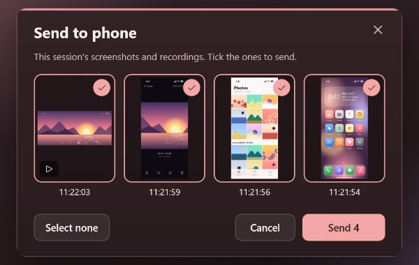
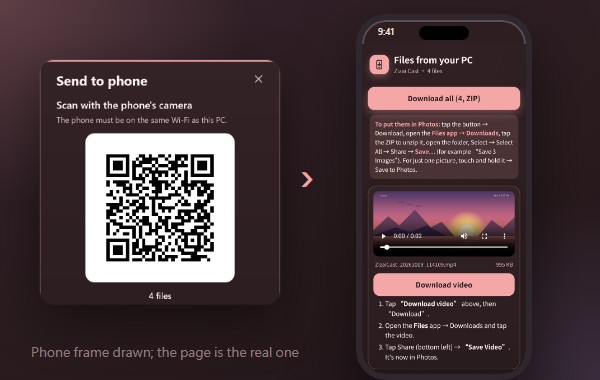
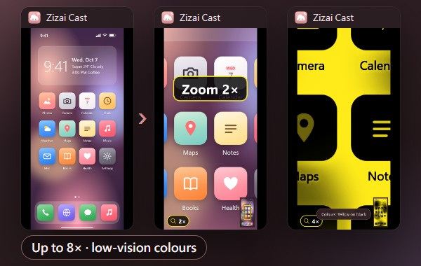
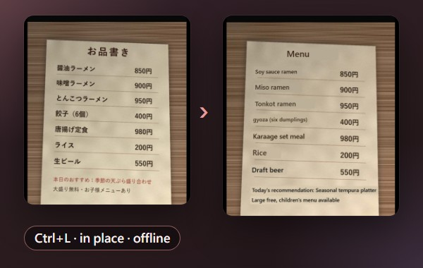
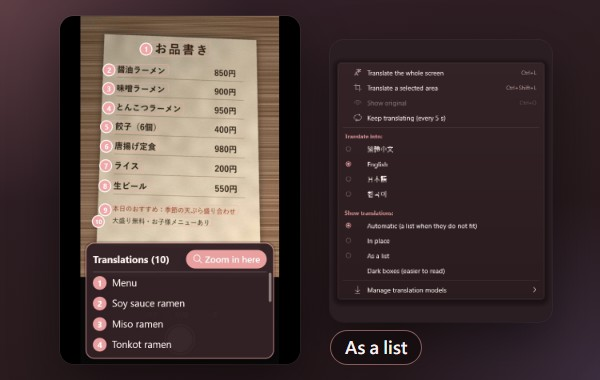

<div align="center">


[繁體中文](README.md) ・ **English**

# Zizai Cast 自在投影

**Mirror your iPhone, iPad or Android phone to a Windows PC, wirelessly.**<br>
No app on the iPhone, and you can drive an Android phone with your mouse and keyboard. Free, open source, no ads, no account.

<a href="https://victor900106.github.io/ZizaiCast/download/zizai-setup-latest.exe"></a>

[Website](https://victor900106.github.io/ZizaiCast/#en) ・ [All releases](https://github.com/victor900106/ZizaiCast/releases) ・ [How to connect](#start) ・ [FAQ](#faq) ・ [Privacy](#privacy)


<sub>Real app footage (recorded off-screen; title bar and backdrop added afterwards). The phone content is a synthetic demo screen with no real personal data.</sub>

</div>

---

What's on your phone often needs a bigger screen: showing an app to a class, making the text large enough for a parent to read, a menu abroad you can't read, a walkthrough you want to record. Zizai Cast does exactly that. Put the phone and the PC on the same Wi‑Fi, pick “Zizai Cast” on the phone, and the picture and sound appear on the PC. Recording, screenshots, zoom and translation all happen in that one window, and nothing leaves your home network.

## Highlights

- **iPhone / iPad, no app needed**: Control Center → Screen Mirroring → “Zizai Cast”. Picture and sound (AirPlay).
- **Android, two ways**: the phone's built-in *Cast / Smart View* (Miracast), or scan a QR code for *wireless debugging*, which lets you **control the phone with the PC's mouse and keyboard**.
- **Low latency, sharp picture**: about 3 ms from decode to display on the PC (H.264 hardware decode, developer measurement); up to 3840×2160 at 60 fps (H.265).
- **Record, screenshot, send to phone**: one click to MP4 (with audio) or PNG, then send several files back to the phone at once.
- **Magnifier and low-vision colours**: zoom up to 8×, more contrast, greyscale, inverted, yellow on black, freeze the picture.
- **On-screen translation**: English, Japanese, Korean and Simplified Chinese into English, Traditional Chinese, Japanese or Korean. Text recognition and translation **run offline on your PC**; add the optional on-device AI translation, or turn on online translation with your own key.
- **Four UI languages**: English, 繁體中文, 日本語, 한국어; one-click updates when a new version is out (never updates by itself).
- **Stays on your network**: no telemetry, no account; the only routine internet access is the update check ([privacy](#privacy)).

## New in 0.7.9

| | |
|---|---|
| **Live translation follows the screen** | Live translation stays drawn over the original text and moves with it while the phone screen scrolls, so you don't have to translate again. |
| **Clearer menus** | *Connect a phone ▸* replaces *Android ▸* and starts with *How to connect?*; the screenshot and recording folders are on the first level; *Help ▸ Keyboard shortcuts* (F1). |
| **Act right after a capture** | When a screenshot or recording is done, click *Open folder* or *Send to phone* on the notice. |
| **Settings in plain words** | *Picture quality* Standard (smoothest) / High (recommended) / Highest (needs strong Wi‑Fi); *When a second phone connects*: switch to the new one / keep the current one; closing the window can *keep running in the background*, and the app tells you where its icon is. |
| **Visible before a phone connects** | Screenshot, recording and magnifier are always in the menu, marked “Once a phone is connected” until one is. |

Full change list on [Releases](https://github.com/victor900106/ZizaiCast/releases/latest).

<a id="start"></a>

## How to connect, in 3 steps

**Before you start**: [download and install Zizai Cast](https://victor900106.github.io/ZizaiCast/download/zizai-setup-latest.exe) (fast mirror; backup: `zizai-setup-<version>.exe` on [Releases](https://github.com/victor900106/ZizaiCast/releases/latest); no admin rights needed) and put the phone and PC on the same Wi‑Fi (not a guest network; turn VPNs off). When Windows Firewall asks on first start, allow **Private networks**.


| | 1 | 2 | 3 |
|---|---|---|---|
| **iPhone / iPad** (AirPlay, no app) | Open Control Center, tap *Screen Mirroring* | Pick **Zizai Cast** | Picture and sound appear on the PC |
| **Android: view only** (Miracast) | Open Quick Settings, tap *Cast* (Samsung: *Smart View*) | Pick **Zizai Cast** | The phone appears on the PC (the PC needs the Windows “Wireless Display” feature) |
| **Android: control from the PC** (wireless debugging, Android 11+) | *Developer options → Wireless debugging → Pair device with QR code* | Scan the QR code from *Connect a phone ▸ Connect Android (scan QR)* on the PC | Control the phone with mouse and keyboard; it reconnects automatically |

The picture shows an iPhone. Forgot how? *Connect a phone ▸ How to connect?* is always in the app.

<div align="center"></div>

## Features

All images show the real app; the phone content is a synthetic demo screen.

### Mirror and control

<table>
<tr>
<td width="33%" valign="top"><br><b>iPhone / iPad mirroring</b><br>AirPlay screen mirroring with sound, no app on the phone. The iPhone's volume buttons set the PC volume.</td>
<td width="33%" valign="top"><br><b>Android Cast</b><br>Pick Zizai Cast from the phone's Cast / Smart View tile (Miracast). <a href="#faq">Needs the Windows “Wireless Display” feature</a>.</td>
<td width="33%" valign="top"><br><b>Control Android from the PC</b><br>Click to tap, drag to swipe, wheel to scroll, right-click for Back, type on your keyboard; Back / Home / Recents on the toolbar.</td>
</tr>
<tr>
<td valign="top"><br><b>QR-code pairing</b><br>Android 11+: scan once, reconnects automatically; a 6-digit pairing code works too.</td>
<td valign="top"><br><b>Landscape and rotation</b><br>Turn the phone and the window follows; rotate 90° or flip by hand.</td>
<td valign="top"><br><b>Several phones, in turn</b><br>When a second phone connects: switch to the new one, or keep the current one. No restart.</td>
</tr>
</table>

### Record and share

<table>
<tr>
<td width="33%" valign="top"><br><b>Recording</b><br>Ctrl+R records MP4 (60 fps, with audio); saved automatically on disconnect or when another phone takes over.</td>
<td width="33%" valign="top"><br><b>Screenshots</b><br>Ctrl+S saves a PNG, with the device frame (transparent background) when the frame is on.</td>
<td width="33%" valign="top"><br><b>iPhone frame</b><br>Ctrl+F wraps the picture in a phone frame for tutorials and demos.</td>
</tr>
<tr>
<td valign="top"><br><b>Send to phone, on the PC</b><br>Tick this session's screenshots and recordings and send them at once.</td>
<td valign="top"><br><b>Send to phone, on the phone</b><br>An iPhone scans the QR code (same Wi‑Fi) and taps <i>Download all (ZIP)</i>; over wireless debugging Android saves straight to the gallery. <sub>Phone frame drawn.</sub></td>
<td valign="top"></td>
</tr>
</table>

### See it clearly, read it

<table>
<tr>
<td width="33%" valign="top"><br><b>Magnifier</b><br>Ctrl+wheel zooms up to 8× with a draggable overview; low-vision colours (Ctrl+K) and freeze (Ctrl+P).</td>
<td width="33%" valign="top"><br><b>Translation, in place</b><br>Ctrl+L translates offline, drawn right over the original. <sub>The menu is a synthetic test picture.</sub></td>
<td width="33%" valign="top"><br><b>Translation, as a list</b><br>Numbered marks on the original, translations in a list; switch automatic / in place / list.</td>
</tr>
</table>

The details: navigation bars, buttons, furigana and address bars are not mistranslated; wrapped paragraphs are translated as one sentence; brand names, @handles, #hashtags and links are kept; negations and numbers are checked and doubtful lines are marked. For more natural wording, download the **on-device AI translation** (about 1.3 GB, or 560 MB for the small model; runs on your PC, faster with a dedicated graphics card), or turn on **online translation** with your own DeepL / Azure key (off by default).

### Comfortable to use

<table>
<tr>
<td width="33%" valign="top"><br><b>4 themes</b><br>Sakura, Mint, Night, Milk tea, with Toutou the cloud sprite keeping you company while you wait.</td>
<td width="33%" valign="top"><br><b>Four UI languages</b><br>English, 繁體中文, 日本語, 한국어 (Settings → Language), defaulting to your Windows language.</td>
<td width="33%" valign="top"><br><b>Connection PIN</b><br>When on, a new iPhone must enter the 4-digit PIN shown on the PC. <sub>Illustration.</sub></td>
</tr>
<tr>
<td valign="top"><br><b>Background and updates</b><br>Closing the window keeps it running in the background or quits (your choice); start with Windows, always on top; “Update to vX.Y.Z” when a new version exists.</td>
<td valign="top"><br><b>Open and transparent</b><br>“About Zizai Cast” shows the version, the GPL-3.0 licence, where the source lives and the open-source components.</td>
<td valign="top"><br><b>Low latency</b><br>≈3 ms decode → display on the PC; up to 4K at 60 fps. <a href="#measured">See the measurements</a>.</td>
</tr>
</table>

<a id="measured"></a>

## Measured numbers

Measured by the developer on one PC (RTX 3060 Ti, October 2026). Your results depend on your PC, Wi‑Fi and phone.

| What | Result |
|---|---|
| PC decode → display | ≈ 3 ms (H.264, hardware decode) |
| Picture quality | Standard 1920×1080 H.264 / High 2560×1440 and Highest 3840×2160 H.265, all 60 fps |
| Audio resume | < 50 ms |
| Recording A/V offset | 0.2 ms (test files) |
| Soak test | 61 minutes continuous, no memory / resource leaks |

End-to-end latency also includes the phone's encoder and Wi‑Fi, which depend on your phone and network and are not included in the 3 ms.

<a id="requirements"></a>

## Requirements and downloads

| | |
|---|---|
| PC | Windows 10 / 11, 64-bit |
| Network | Phone and PC on the same local network (5 GHz Wi‑Fi or wired PC recommended) |
| iPhone / iPad | Any iOS / iPadOS device with Screen Mirroring |
| Android Cast | Phone with Cast / Smart View (Miracast); the PC needs the Windows optional feature “Wireless Display”, a supporting Wi‑Fi adapter and Wi‑Fi on. Google Pixel phones don't do Miracast; use wireless debugging |
| Android control | Android 11+ with *Developer options → Wireless debugging* |
| High / Highest quality (1440p / 4K) | An HEVC decoder on the PC (Microsoft Store “HEVC Video Extensions”); otherwise 1080p is used |

| Download | |
|---|---|
| [**`zizai-setup-<version>.exe`**](https://victor900106.github.io/ZizaiCast/download/zizai-setup-latest.exe) ([Releases backup](https://github.com/victor900106/ZizaiCast/releases/latest)) | The Windows installer, for most people. No admin rights; installs to a “Zizai Cast” folder on the Desktop by default (“手機投影” in Chinese). |
| `ZizaiCast-<version>-source.zip` | Complete source of that version + build instructions (same release page) |
| `ZizaiCast-<version>-deps-source.zip` | Sources of the bundled libraries (OpenSSL, libplist, FFmpeg …) |

## Shortcuts

Press **F1** in the app (Help ▸ Keyboard shortcuts) to see them too.

| Key | Action | Key | Action |
|---|---|---|---|
| F11 / double-click | Fullscreen | Ctrl+D | Disconnect |
| Ctrl+S | Screenshot | Ctrl+R | Start / stop recording |
| Ctrl+→ / Ctrl+← | Rotate 90° | Ctrl+H | Flip horizontally |
| Ctrl+F | iPhone frame | Ctrl+0 | Reset view |
| Ctrl+T | Always on top | Right-click | Full menu (on an Android picture it is *Back*; Shift+right-click opens the menu) |
| Ctrl+wheel | Magnifier (up to 8×) | Ctrl+K | Low-vision colours |
| Ctrl+P | Freeze the picture | Ctrl+L | On-screen translation |
| Ctrl+↑ / Ctrl+↓ | Volume | Ctrl+M | Mute |

<a id="faq"></a>

## FAQ

<details>
<summary><b>“Windows protected your PC” when installing?</b></summary>

The installer isn't code-signed yet, so SmartScreen warns. Click *More info → Run anyway*, or build from the source zip on the release page.
</details>

<details>
<summary><b>The iPhone doesn't see “Zizai Cast”?</b></summary>

- Same Wi‑Fi / LAN (not a guest network or mobile data); school, office and hotel networks often block device discovery.
- Allow the app on **Private networks** in Windows Firewall (search “Allow an app through Windows Firewall”).
- Turn off VPNs on the PC and the phone.
- Only one AirPlay receiver can run per PC; close other receivers first.
</details>

<details>
<summary><b>Can I control the iPhone from the PC?</b></summary>

No. AirPlay carries picture and sound only and iOS offers no way for a PC to control the phone. PC control works for Android (wireless debugging).
</details>

<details>
<summary><b>Netflix / Disney+ show a black screen?</b></summary>

DRM-protected video is blacked out by the phone itself during screen mirroring; no receiver can bypass that.
</details>

<details>
<summary><b>Android Cast (Miracast) doesn't connect / is greyed out?</b></summary>

Install the Windows optional feature **Wireless Display** (Settings → System → Optional features), reboot, and check that your Wi‑Fi adapter supports it: `netsh wlan show drivers` must say “Wireless Display Supported: Yes”. Don't run a mobile hotspot at the same time. Otherwise use wireless debugging. Miracast audio is played by Windows and is not included in recordings.
</details>

<details>
<summary><b>Wireless debugging keeps disconnecting?</b></summary>

Needs Android 11+. Phones often turn wireless debugging off after a reboot; just turn it back on. Battery savers can also interfere. If it still fails, remove the pairing on the phone and scan the QR code again. Turn wireless debugging off when you don't use it, and never on public Wi‑Fi.
</details>

<details>
<summary><b>Lag, stutter or a blurry picture?</b></summary>

Use 5 GHz Wi‑Fi or a wired PC. For the lowest latency choose *Picture quality ▸ Standard (smoothest)*; for a sharper picture *High* or *Highest* (needs HEVC Video Extensions; applies from the next connection).
</details>

<details>
<summary><b>Where did the app go after I closed the window?</b></summary>

With *Keep running in the background*, it keeps receiving mirroring and the window comes back when a phone connects. To open it yourself, click the Zizai Cast icon at the right end of the taskbar; if you don't see it, click ^ and drag the icon onto the taskbar. To quit, right-click the icon → *Quit*, or set *Settings ▸ When closing the window* to quit.
</details>

<details>
<summary><b>macOS / Linux?</b></summary>

Windows 10 / 11 (64-bit) only for now.
</details>

<details>
<summary><b>Is it really free? Why?</b></summary>

Yes. Zizai Cast is GPL-3.0 open source, built on UxPlay, scrcpy, FFmpeg and other open-source projects. No paid tier, no ads, no data collection. If you like it, a Star on GitHub helps others find it.
</details>

<a id="limits"></a>

## Known limits

- **The iPhone can't be controlled from the PC** (AirPlay limitation).
- **DRM video shows black** (blocked on the phone).
- **Miracast needs the Windows “Wireless Display” feature** and a supporting Wi‑Fi adapter; Miracast audio isn't recorded.
- **Android wireless debugging needs Android 11+.**
- **YouTube's “AirPlay video” (URL hand-off) mode isn't supported**; use screen mirroring.
- **The installer is unsigned**, so SmartScreen warns.
- Windows 10 / 11 64-bit only.

<a id="privacy"></a>

## Privacy

- **Picture, sound, recordings and screenshots stay on your LAN and your PC.** No server is involved.
- **No telemetry, no analytics, no ads, no account.**
- The only routine internet access is the **update check** (source: `app/update/updater.cpp`; translation models are downloaded and online translation is used only if you agree or turn it on, see below):
  - 30 s after start, then every 24 h, and when you click *Check for updates*: one HTTPS GET to `https://github.com/victor900106/ZizaiCast/releases/latest/download/update.json` with ordinary HTTP headers (User-Agent `ZizaiProjection-Updater/1.0`), no device information.
  - Only when you click *Update to vX.Y.Z* is the installer downloaded from the URL in that manifest (`https://victor900106.github.io/ZizaiCast/download/`, faster than release assets), verified with SHA-256 and run.
  - To turn it off completely, add the line `update_url=` (empty) to `%LOCALAPPDATA%\PhoneMirror\settings.ini`.
- **On-screen translation runs entirely offline on your PC** (source: `translate/`): neither the picture nor the text is uploaded. The app asks before the first use and only then downloads the models: translation (Firefox Translations, about 50 MB) from `firefox-settings-attachments.cdn.mozilla.net` / `firefox.settings.services.mozilla.com`, text recognition (PaddleOCR, about 37 MB) from `www.modelscope.cn`; every file is checked with SHA-256 and can be removed under *Manage translation models*. If you decline, nothing is downloaded.
- **On-device AI translation (optional) also runs on your PC**: only when you choose to download it, the app fetches the llama.cpp runtime (MIT, the official files unchanged) from this project's mirror `victor900106.github.io/ZizaiCast/addons/` (falling back to `github.com`) and a Qwen model (Apache-2.0) from `huggingface.co`, about 1.3 GB (560 MB for the small model); the add-on for text recognition on the graphics card comes from Microsoft's `api.nuget.org`. Every file is checked for size and SHA-256 and can be removed any time.
- **Online translation (optional) is off by default** (source: `translate/src/online_engine*.cpp`): only after you turn it on, agree and enter your own DeepL or Azure key is the recognised text (never the picture) sent over HTTPS to the service you picked (`api.deepl.com` / `api-free.deepl.com` or `api.cognitive.microsofttranslator.com`). The key is encrypted with Windows DPAPI on this PC and never written to the log. Unless you turn it on, nothing is sent.
- **Send to phone stays on your LAN** (source: `share/`): Android gets files over wireless debugging; other phones scan a QR code and download from a page this PC serves temporarily (only connections from the same local network are accepted). No server in between.
- Everything else is local-network traffic: AirPlay discovery (mDNS) and streaming, Miracast (built into Windows), Android wireless debugging (the bundled adb talks only to phones you paired).
- Settings and the log file live in `%LOCALAPPDATA%\PhoneMirror` (`settings.ini`, `phonemirror.log`) on your PC.

<a id="roadmap"></a>

## Roadmap

Ideas **under consideration**, not promises, no dates. Tell us what matters to you in [Issues](https://github.com/victor900106/ZizaiCast/issues):

- [ ] Code-signed installer (fewer SmartScreen warnings)
- [ ] A reliable A/V-sync mode for watching videos
- [ ] YouTube “AirPlay video” mode
- [ ] Install via winget

<a id="build"></a>

## Building from source

Visual Studio 2026 Build Tools (MSVC), CMake ≥ 3.25 and vcpkg (`x64-windows`). Exact versions and steps: `BUILD.md` inside every release's `source.zip`, and `docs/licenses/SOURCE.md`.

```bat
vcpkg install openssl libplist pthreads alac "ffmpeg[core,avcodec]" --triplet x64-windows
cmake -S . -B build -G "Visual Studio 18 2026" -A x64 -DCMAKE_TOOLCHAIN_FILE=<vcpkg>/scripts/buildsystems/vcpkg.cmake
cmake --build build --config Release
```

Want to help? See [CONTRIBUTING.md](CONTRIBUTING.md). Report problems via [Issues](https://github.com/victor900106/ZizaiCast/issues/new/choose).

<a id="license"></a>

## License

Zizai Cast is free software, distributed under the GNU General Public License version 3 (GPL-3.0; see [LICENSE](LICENSE)). The complete Corresponding Source of every release is attached to the same GitHub release as the installer:

```
https://github.com/victor900106/ZizaiCast/releases
    ZizaiCast-<version>-source.zip       (this program + build instructions)
    ZizaiCast-<version>-deps-source.zip  (sources of the third-party libraries)
```

Versions, licences and copyright notices of all third-party components: [`docs/licenses/THIRD_PARTY_NOTICES.txt`](docs/licenses/THIRD_PARTY_NOTICES.txt); how the source is provided: [`docs/licenses/SOURCE.md`](docs/licenses/SOURCE.md).

The cloud sprite mascot Toutou (投投) is an original character of this project; the artwork lives in [`assets/public/toutou/`](assets/public/toutou/).

## Acknowledgements

Zizai Cast stands on the shoulders of:

- [UxPlay](https://github.com/FDH2/UxPlay) (AirPlay receiver; and its ancestors [RPiPlay](https://github.com/FD-/RPiPlay), [ShairPlay](https://github.com/juhovh/shairplay), dsafa22's AirplayServer, PlayFair)
- [scrcpy](https://github.com/Genymobile/scrcpy) (the on-phone server for Android video and control) and Android [platform-tools (adb)](https://developer.android.com/tools/releases/platform-tools)
- [FFmpeg](https://ffmpeg.org/) (AAC decoding), [OpenSSL](https://www.openssl.org/), [libplist](https://github.com/libimobiledevice/libplist), [pthreads4w](https://sourceforge.net/projects/pthreads4w/), Apple [ALAC](https://github.com/macosforge/alac), [llhttp](https://github.com/nodejs/llhttp)
- [Nayuki QR Code generator](https://github.com/nayuki/QR-Code-generator), [Inno Setup](https://jrsoftware.org/isinfo.php)
- On-screen translation: [Bergamot](https://github.com/browsermt/bergamot-translator) / [Firefox Translations](https://github.com/mozilla/translations), [ONNX Runtime](https://github.com/microsoft/onnxruntime), [PaddleOCR](https://github.com/PaddlePaddle/PaddleOCR), [llama.cpp](https://github.com/ggml-org/llama.cpp), [Qwen](https://github.com/QwenLM); glossary data from [Wikidata](https://www.wikidata.org) and the Traditional Chinese translations of GNOME, KDE, LibreOffice and Mozilla

---

<div align="center">

[Download](https://victor900106.github.io/ZizaiCast/download/zizai-setup-latest.exe) ・ [Website](https://victor900106.github.io/ZizaiCast/#en) ・ [Report a bug](https://github.com/victor900106/ZizaiCast/issues/new/choose) ・ [Request a feature](https://github.com/victor900106/ZizaiCast/issues/new/choose)

If it's useful to you, a Star on GitHub helps more people find Zizai Cast.

</div>
