<div align="center">

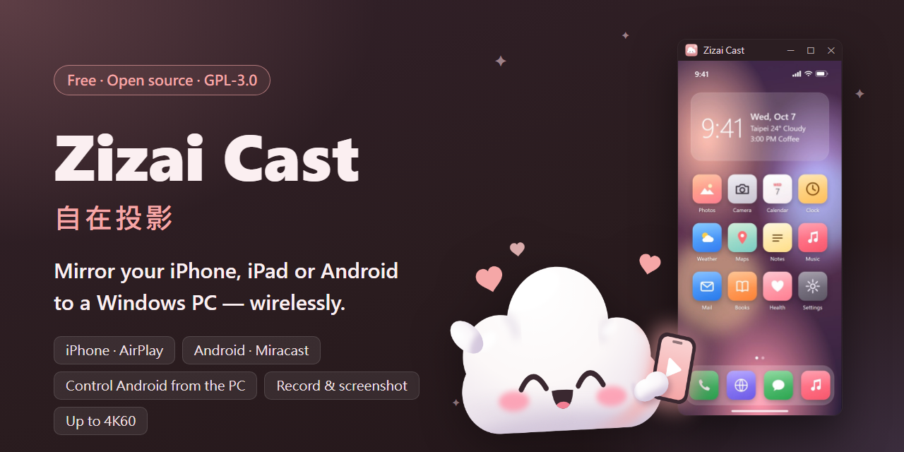

[繁體中文](README.md) ・ **English**

# Zizai Cast 自在投影

**Mirror your iPhone, iPad or Android phone to a Windows PC — wirelessly.**<br>
No app on the iPhone, and you can drive an Android phone with your mouse and keyboard. Free, open source, no ads, no account.

[](https://github.com/victor900106/ZizaiCast/releases/latest)
[](https://github.com/victor900106/ZizaiCast/releases)
[](#license)
[-BBA9F7?logo=windows)](#requirements)
[](#build)

<a href="https://github.com/victor900106/ZizaiCast/releases/latest"></a>

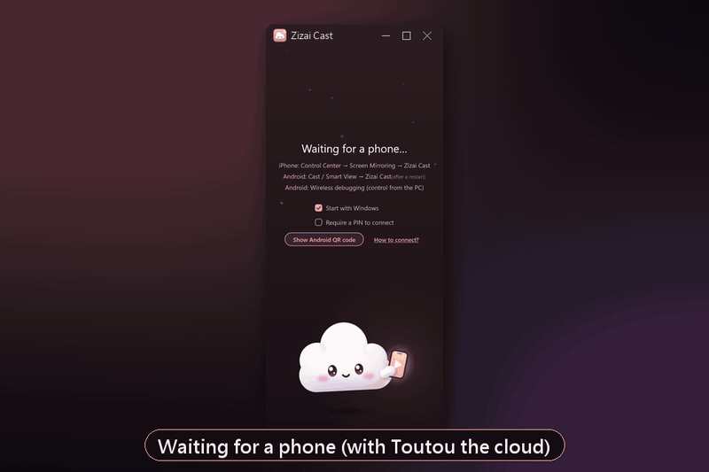

<sub>Real app footage (recorded off-screen; title bar and backdrop added afterwards). The phone content is a synthetic demo screen — no real personal data.</sub>

</div>

---

## ✨ Highlights

- 🍎 **iPhone / iPad, no app needed** — Control Center → Screen Mirroring → “Zizai Cast”. Picture and sound (AirPlay).
- 🤖 **Android, two ways** — the phone's built-in *Cast / Smart View* (Miracast), or scan a QR code for *wireless debugging* — which lets you **control the phone with the PC's mouse and keyboard**.
- ⚡ **Low latency** — about **3 ms** from decode to display on the PC (H.264 hardware decode, developer measurement); up to **3840×2160 (4K) at 60 fps** with H.265.
- ⏺ **Record & screenshot** — one click to MP4 (with audio) or PNG; 0.2 ms A/V offset measured in recording tests.
- 🎨 **Pleasant to use** — iPhone device frame, rotation, 4 themes, multi-phone takeover, PIN, tray icon, start with Windows, one-click updates; **English and Traditional Chinese UI**.
- 🔒 **Stays on your network** — the stream never leaves your LAN; no telemetry, no account. The only internet access is the update check ([details](#privacy)).
- 🆓 **Free, open source (GPL-3.0), no ads.**

## 🚀 Get started in 3 steps

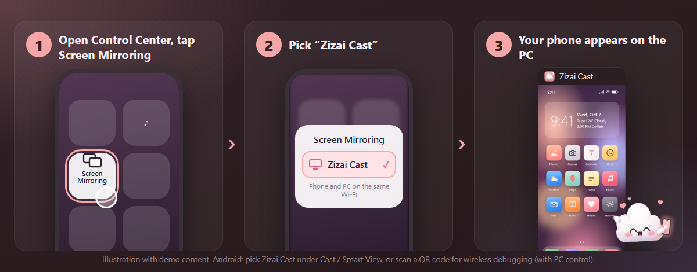

1. **Install** — download the latest `zizai-setup-<version>.exe` from [Releases](https://github.com/victor900106/ZizaiCast/releases/latest) and run it (no admin rights needed). When Windows Firewall asks on first start, allow **Private networks**.
2. **Same Wi‑Fi** — phone and PC on the same network (not a guest network; turn VPNs off).
3. **Connect**
   - **iPhone / iPad:** Control Center → *Screen Mirroring* → **Zizai Cast**.
   - **Android (view only):** Quick Settings → *Cast* (Samsung: *Smart View*) → **Zizai Cast**.
   - **Android (with PC control):** on the phone, *Developer options → Wireless debugging → Pair device with QR code*, then scan the QR code from **Show Android QR code** on the PC. It reconnects automatically afterwards while wireless debugging is on.

<div align="center">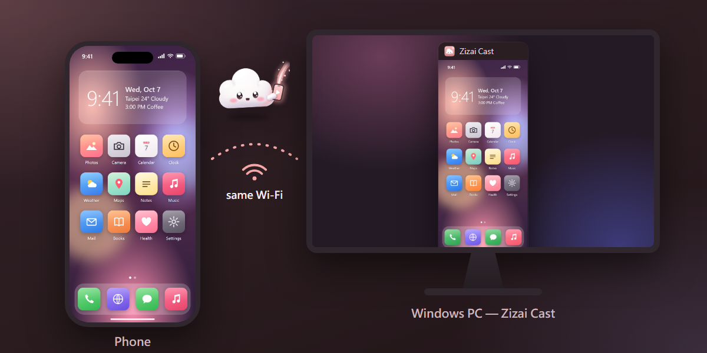</div>

## 🧩 Features

<table>
<tr>
<td width="33%" valign="top">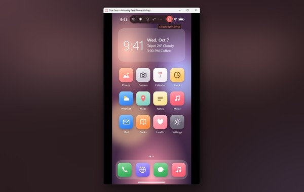<br><b>🍎 iPhone / iPad mirroring</b><br>AirPlay screen mirroring with sound, no app on the phone. The iPhone's volume buttons set the PC volume.</td>
<td width="33%" valign="top">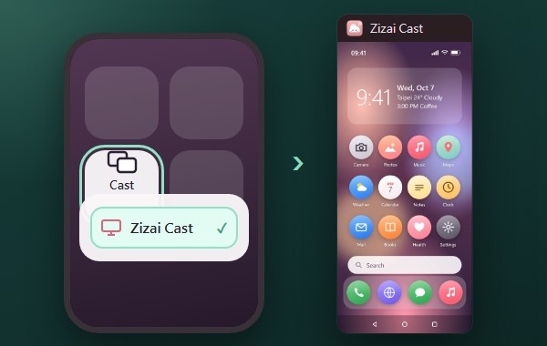<br><b>🤖 Android Cast (Miracast)</b><br>Pick Zizai Cast from the phone's Cast / Smart View tile. <a href="#faq">Needs the Windows “Wireless Display” feature</a>.</td>
<td width="33%" valign="top">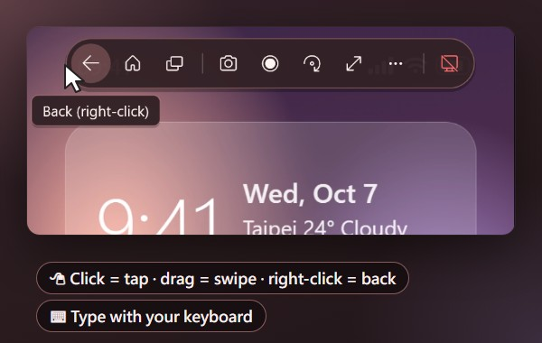<br><b>🖱️ Control Android from the PC</b><br>Over wireless debugging: click = tap, drag = swipe, wheel = scroll, right-click = back, type on your keyboard; Back / Home / Recents in the toolbar.</td>
</tr>
<tr>
<td valign="top">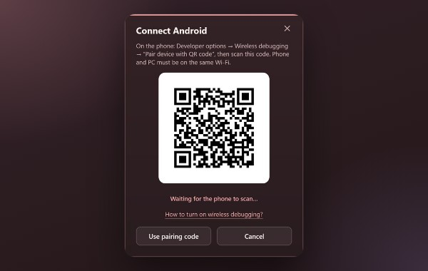<br><b>📷 QR-code pairing</b><br>Android 11+: scan once, reconnects automatically; a 6-digit pairing code works too.</td>
<td valign="top">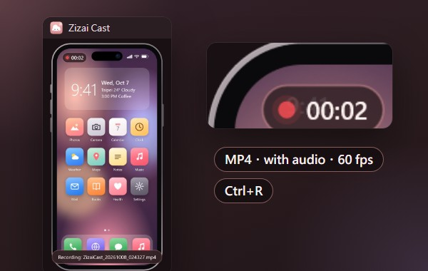<br><b>⏺ Recording</b><br>Ctrl+R records MP4 (60 fps, with audio) with an on-screen timer; saved automatically on disconnect or takeover.</td>
<td valign="top">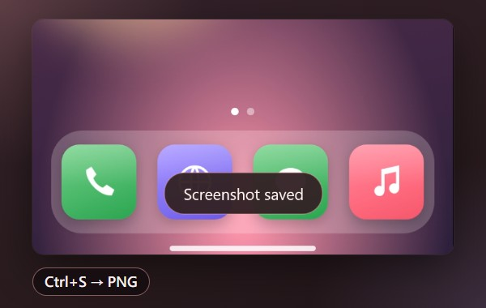<br><b>📸 Screenshots</b><br>Ctrl+S or the toolbar saves a PNG — with the device frame (transparent background) when the frame is on.</td>
</tr>
<tr>
<td valign="top">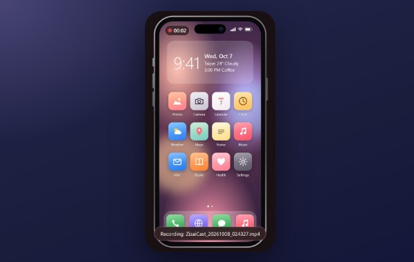<br><b>📱 iPhone frame</b><br>Ctrl+F wraps the picture in a phone frame — nice for tutorials and demos.</td>
<td valign="top">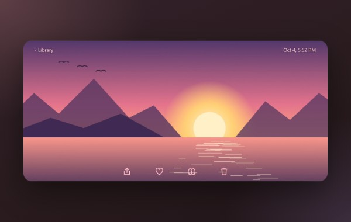<br><b>🔄 Landscape & rotation</b><br>Turn the phone and the window follows; rotate 90° or flip by hand (Ctrl+→ / Ctrl+H).</td>
<td valign="top">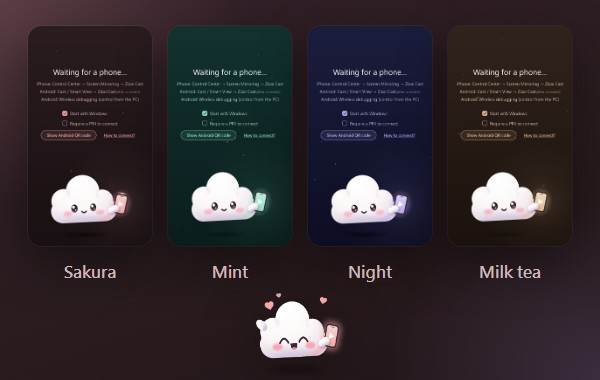<br><b>🎨 4 themes</b><br>Sakura, Mint, Night, Milk tea — with Toutou, our cloud mascot, keeping you company while you wait.</td>
</tr>
<tr>
<td valign="top">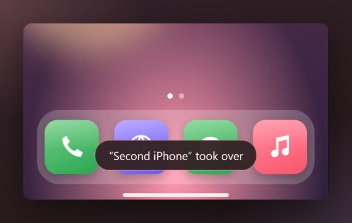<br><b>👥 Multi-phone takeover</b><br>When another phone connects: let it take over, or keep the current one.</td>
<td valign="top">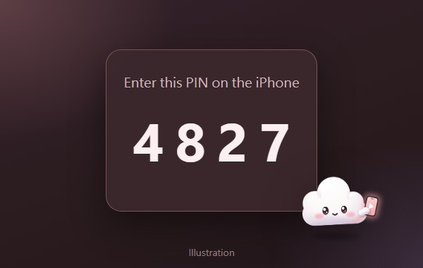<br><b>🔒 Connection PIN</b><br>New iPhones must enter the 4-digit PIN shown on the PC (remembered afterwards). <sub>Illustration.</sub></td>
<td valign="top">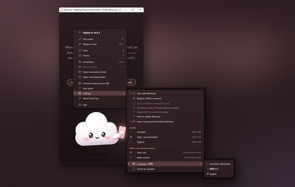<br><b>🌐 English / 繁體中文</b><br>Switch the UI language under Settings → Language (defaults to your Windows display language).</td>
</tr>
<tr>
<td valign="top">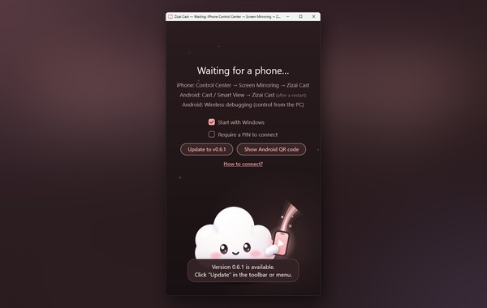<br><b>🧰 Menu, tray & updates</b><br>Closes to the tray, starts with Windows, always-on-top, fullscreen; one-click “Update to vX.Y.Z” when a new version exists (never updates by itself).</td>
<td valign="top">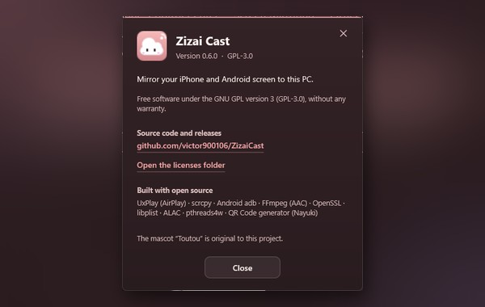<br><b>📜 Open & transparent</b><br>“About Zizai Cast” shows the version, the GPL-3.0 licence, where the source lives and the open-source components; licence notices ship with the app.</td>
<td valign="top">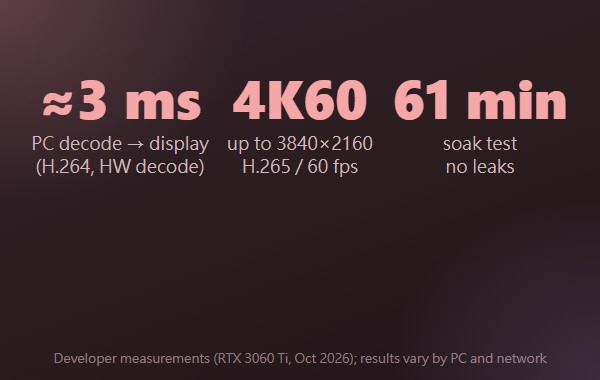<br><b>⚡ Low latency</b><br>≈3 ms decode → display on the PC; up to 4K at 60 fps. <a href="#measured">See the measurements</a>.</td>
</tr>
</table>

<a id="measured"></a>

## 📊 Measured numbers

Measured by the developer on one PC (RTX 3060 Ti, October 2026). Your results depend on your PC, Wi‑Fi and phone.

| What | Result |
|---|---|
| PC decode → display | ≈ 3 ms (H.264, hardware decode) |
| Quality presets | 1920×1080 H.264 / 2560×1440 and 3840×2160 H.265, all 60 fps |
| Audio resume | < 50 ms |
| Recording A/V offset | 0.2 ms (test files) |
| Soak test | 61 minutes continuous, no memory / resource leaks |

End-to-end latency also includes the phone's encoder and Wi‑Fi, which we don't control and did not include in the 3 ms.


## 🤔 Why Zizai Cast

| | **Zizai Cast** | Typical paid mirroring apps |
|---|---|---|
| Price | ✅ Free | Usually one-off purchase or subscription (varies) |
| Open source | ✅ GPL-3.0 | Usually closed source |
| Ads | ✅ None | Varies |
| Account required | ✅ No | Varies |
| App on the iPhone | ✅ Not needed (AirPlay) | Most AirPlay receivers don't need one either |
| Control Android from the PC | ✅ Yes (wireless debugging) | Varies |
| Recording / screenshots | ✅ Built in | Most have it |
| Where your data goes | ✅ LAN only, no telemetry | Varies |

> We don't compare against specific products; the table only states what we can guarantee for ourselves. If you need macOS / Linux, or want to control an iPhone from the PC, Zizai Cast can't do that (see [limits](#limits)).

## 📥 Download & requirements

| Download | |
|---|---|
| [**`zizai-setup-<version>.exe`**](https://github.com/victor900106/ZizaiCast/releases/latest) | The Windows installer — for most people. No admin rights; installs to a “Zizai Cast” folder on the Desktop by default (“手機投影” in Chinese). |
| `ZizaiCast-<version>-source.zip` | Complete source of that version + build instructions (same release page) |
| `ZizaiCast-<version>-deps-source.zip` | Sources of the bundled libraries (OpenSSL, libplist, FFmpeg …) |

<a id="requirements"></a>

### Requirements

| | |
|---|---|
| PC | Windows 10 / 11, 64-bit |
| Network | Phone and PC on the same local network (5 GHz Wi‑Fi or wired PC recommended) |
| iPhone / iPad | Any iOS / iPadOS device with Screen Mirroring |
| Android Cast | Phone with Cast / Smart View (Miracast); the PC needs the Windows optional feature “Wireless Display”, a supporting Wi‑Fi adapter and Wi‑Fi on. Google Pixel phones don't do Miracast — use wireless debugging |
| Android control | Android 11+ with *Developer options → Wireless debugging* |
| 1440p / 4K presets | An HEVC decoder on the PC (Microsoft Store “HEVC Video Extensions”); otherwise 1080p is used |

## ⌨️ Shortcuts

| Key | Action | Key | Action |
|---|---|---|---|
| F11 / double-click | Fullscreen | Ctrl+D | Disconnect |
| Ctrl+S | Screenshot | Ctrl+R | Start / stop recording |
| Ctrl+→ / Ctrl+← | Rotate 90° | Ctrl+H | Flip horizontally |
| Ctrl+F | iPhone frame | Ctrl+0 | Reset view |
| Ctrl+T | Always on top | Right-click | Full menu (on an Android picture it is *Back*; use the toolbar's *More* ⋯ instead) |

<a id="faq"></a>

## ❓ FAQ

<details>
<summary><b>“Windows protected your PC” when installing?</b></summary>

The installer isn't code-signed yet, so SmartScreen warns. Click *More info → Run anyway*, or build from the source zip on the release page.
</details>

<details>
<summary><b>The iPhone doesn't see “Zizai Cast”?</b></summary>

- Same Wi‑Fi / LAN (not a guest network or mobile data); school, office and hotel networks often block device discovery.
- Allow the app on **Private networks** in Windows Firewall (search “Allow an app through Windows Firewall”).
- Turn off VPNs on the PC and the phone.
- Only one AirPlay receiver can run per PC — close other receivers first.
</details>

<details>
<summary><b>Can I control the iPhone from the PC?</b></summary>

No. AirPlay carries picture and sound only and iOS offers no way for a PC to control the phone. PC control works for Android (wireless debugging).
</details>

<details>
<summary><b>Netflix / Disney+ show a black screen?</b></summary>

DRM-protected video is blacked out by the phone itself during screen mirroring; no receiver can bypass that.
</details>

<details>
<summary><b>Android Cast (Miracast) doesn't connect / is greyed out?</b></summary>

Install the Windows optional feature **Wireless Display** (Settings → System → Optional features), reboot, and check that your Wi‑Fi adapter supports it: `netsh wlan show drivers` must say “Wireless Display Supported: Yes”. Don't run a mobile hotspot at the same time. Otherwise use wireless debugging. Miracast audio is played by Windows and is not included in recordings.
</details>

<details>
<summary><b>Wireless debugging keeps disconnecting?</b></summary>

Needs Android 11+. Phones often turn wireless debugging off after a reboot — just turn it back on; battery savers can also interfere. If it still fails, remove the pairing on the phone and scan the QR code again. Turn wireless debugging off when you don't use it, and never on public Wi‑Fi.
</details>

<details>
<summary><b>Lag, stutter or a blurry picture?</b></summary>

Use 5 GHz Wi‑Fi or a wired PC. For the lowest latency choose *Standard* quality; for a sharper picture *High* / *Maximum* (needs HEVC Video Extensions; applies from the next connection).
</details>

<details>
<summary><b>macOS / Linux? Which languages?</b></summary>

Windows 10 / 11 (64-bit) only for now. The interface is English or Traditional Chinese (Settings → Language; defaults to your Windows display language).
</details>

<a id="limits"></a>

## 🚧 Known limits

- **The iPhone can't be controlled from the PC** (AirPlay limitation).
- **DRM video shows black** (blocked on the phone).
- **Miracast needs the Windows “Wireless Display” feature** and a supporting Wi‑Fi adapter; Miracast audio isn't recorded.
- **Android wireless debugging needs Android 11+.**
- **YouTube's “AirPlay video” (URL hand-off) mode isn't supported** — use screen mirroring.
- **The installer is unsigned**, so SmartScreen warns.
- Windows 10 / 11 64-bit only.

<a id="privacy"></a>

## 🔒 Privacy

- **Picture, sound, recordings and screenshots stay on your LAN and your PC.** No server is involved.
- **No telemetry, no analytics, no ads, no account.**
- The only internet access is the **update check** (source: `app/updater.cpp`):
  - 30 s after start, then every 24 h, and when you click *Check for updates*: one HTTPS GET to `https://github.com/victor900106/ZizaiCast/releases/latest/download/update.json` with ordinary HTTP headers (User-Agent `ZizaiProjection-Updater/1.0`), no device information.
  - Only when you click *Update to vX.Y.Z* is the installer from that manifest downloaded, verified with SHA-256 and run.
  - To turn it off completely, add the line `update_url=` (empty) to `%LOCALAPPDATA%\PhoneMirror\settings.ini`.
- Everything else is local-network traffic: AirPlay discovery (mDNS) and streaming, Miracast (built into Windows), Android wireless debugging (the bundled adb talks only to phones you paired).
- Settings and the log file live in `%LOCALAPPDATA%\PhoneMirror` on your PC.

<a id="roadmap"></a>

## 🗺️ Roadmap

Ideas **under consideration** — not promises, no dates. Tell us what matters to you in [Issues](https://github.com/victor900106/ZizaiCast/issues):

- [ ] Code-signed installer (fewer SmartScreen warnings)
- [ ] A reliable A/V-sync mode for watching videos
- [ ] YouTube “AirPlay video” mode
- [ ] Install via winget

<a id="build"></a>

## 🛠️ Building from source

Visual Studio 2026 Build Tools (MSVC), CMake ≥ 3.25 and vcpkg (`x64-windows`). Exact versions and steps: `BUILD.md` inside every release's `source.zip`, and `docs/licenses/SOURCE.md`.

```bat
vcpkg install openssl libplist pthreads alac "ffmpeg[core,avcodec]" --triplet x64-windows
cmake -S . -B build -G "Visual Studio 18 2026" -A x64 -DCMAKE_TOOLCHAIN_FILE=<vcpkg>/scripts/buildsystems/vcpkg.cmake
cmake --build build --config Release
```

Want to help? See [CONTRIBUTING.md](CONTRIBUTING.md). Report problems via [Issues](https://github.com/victor900106/ZizaiCast/issues/new/choose).

<a id="license"></a>

## License

ZizaiCast is free software, distributed under the GNU General Public License version 3 (GPL-3.0; see [LICENSE](LICENSE)). The complete Corresponding Source of every release is attached to the same GitHub release as the installer:

```
https://github.com/victor900106/ZizaiCast/releases
    ZizaiCast-<version>-source.zip       (this program + build instructions)
    ZizaiCast-<version>-deps-source.zip  (sources of the third-party libraries)
```

Versions, licences and copyright notices of all third-party components: [`docs/licenses/THIRD_PARTY_NOTICES.txt`](docs/licenses/THIRD_PARTY_NOTICES.txt); how the source is provided: [`docs/licenses/SOURCE.md`](docs/licenses/SOURCE.md).

The cloud mascot Toutou (投投) is an original character of this project; the artwork lives in [`assets/public/toutou/`](assets/public/toutou/).

## 🙏 Acknowledgements

Zizai Cast stands on the shoulders of:

- [UxPlay](https://github.com/FDH2/UxPlay) (AirPlay receiver; and its ancestors [RPiPlay](https://github.com/FD-/RPiPlay), [ShairPlay](https://github.com/juhovh/shairplay), dsafa22's AirplayServer, PlayFair)
- [scrcpy](https://github.com/Genymobile/scrcpy) (the on-phone server for Android video and control) and Android [platform-tools (adb)](https://developer.android.com/tools/releases/platform-tools)
- [FFmpeg](https://ffmpeg.org/) (AAC decoding), [OpenSSL](https://www.openssl.org/), [libplist](https://github.com/libimobiledevice/libplist), [pthreads4w](https://sourceforge.net/projects/pthreads4w/), Apple [ALAC](https://github.com/macosforge/alac), [llhttp](https://github.com/nodejs/llhttp)
- [Nayuki QR Code generator](https://github.com/nayuki/QR-Code-generator), [Inno Setup](https://jrsoftware.org/isinfo.php)

---

<div align="center">

**Useful? Hit ⭐ Star at the top right so more people can find Zizai Cast!**

[Download](https://github.com/victor900106/ZizaiCast/releases/latest) ・ [Report a bug](https://github.com/victor900106/ZizaiCast/issues/new/choose) ・ [Request a feature](https://github.com/victor900106/ZizaiCast/issues/new/choose)

</div>
