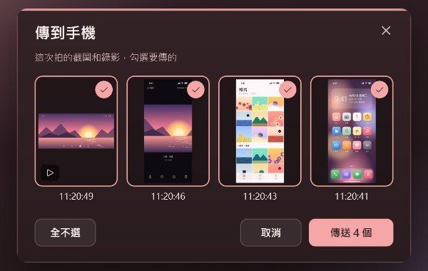
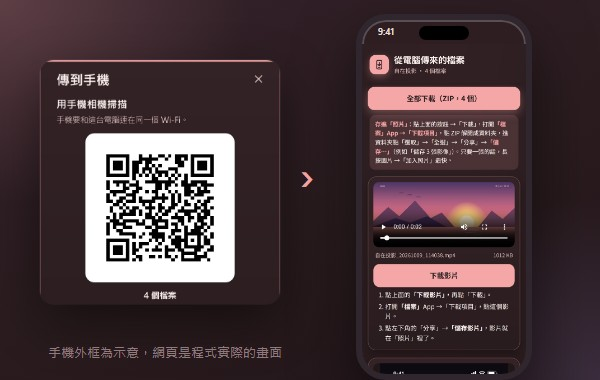
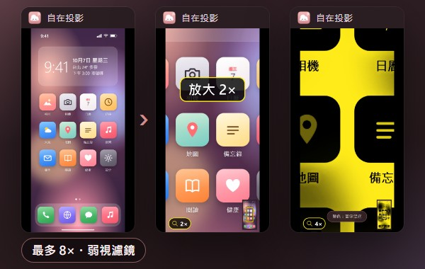
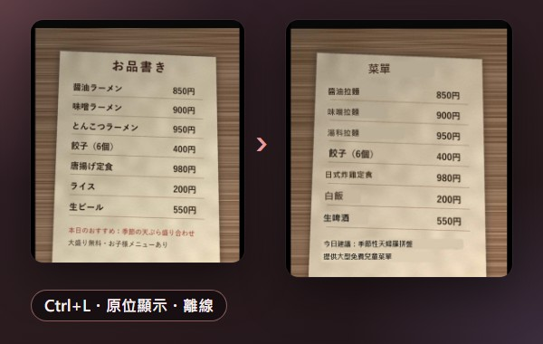
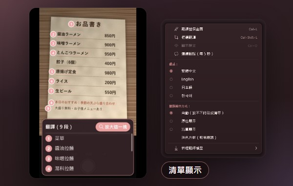

<div align="center">


**繁體中文** ・ [English](README.en.md)

# 自在投影 Zizai Cast

**把 iPhone、iPad、Android 手機畫面，無線投影到 Windows 電腦。**<br>
iPhone 不用裝 App；Android 還能用滑鼠鍵盤直接操控。免費、開源、沒有廣告、不用帳號。

<a href="https://victor900106.github.io/ZizaiCast/download/zizai-setup-latest.exe"></a>

[介紹頁](https://victor900106.github.io/ZizaiCast/) ・ [所有版本](https://github.com/victor900106/ZizaiCast/releases) ・ [怎麼連線](#start) ・ [常見問題](#faq) ・ [隱私](#privacy)


<sub>程式實際畫面（離屏錄製，視窗標題列與背景為後製）；手機內容是示範用的合成畫面，不含真實個人資料。</sub>

</div>

---

手機上的東西，常常需要搬到大螢幕上：上課示範一個 App、幫長輩把字放大看清楚、出國拍到一張看不懂的菜單、把遊戲或操作過程錄下來。自在投影做的就是這一件事：手機和電腦連同一個 Wi‑Fi，從手機選「自在投影」，畫面和聲音就出現在電腦上；之後要錄、要截、要放大、要翻譯，都在同一個視窗裡完成，資料不離開你家的網路。

## 重點

- **iPhone / iPad 免裝 App**：控制中心 →「螢幕鏡像」→「自在投影」，畫面和聲音一起過來（AirPlay）。
- **Android 兩種連法**：手機內建的「投放／Smart View」（Miracast），或掃 QR 碼用「無線偵錯」連線，**可以用電腦的滑鼠、鍵盤直接操控手機**。
- **低延遲、高畫質**：電腦端從解碼到顯示約 3 ms（H.264 硬體解碼，開發者實測）；最高 3840×2160、60 fps（H.265）。
- **錄影、截圖、傳到手機**：一鍵錄成 MP4（含聲音）或截成 PNG，再一次勾選多個檔案傳回手機。
- **放大鏡與弱視濾鏡**：最多放大 8 倍，加強對比、黑白、反轉、黃字黑底，可凍結畫面。
- **畫面翻譯**：英文、日文、韓文、簡體中文翻成繁體中文（或英文、日文、韓文）。文字辨識與翻譯**都在電腦上離線執行**；可選用本機 AI 翻譯，或用自己的金鑰開啟線上翻譯。
- **四語介面**：繁體中文、English、日本語、한국어；有新版時一鍵更新（不會自己偷偷更新）。
- **資料留在你的網路**：沒有遙測、不用帳號；平常唯一的對外連線是檢查更新（[隱私說明](#privacy)）。

## 0.7.9 新功能

| | |
|---|---|
| **即時翻譯跟著畫面走** | 即時翻譯的譯文固定蓋在原文位置，手機畫面捲動時譯文跟著移動，不用每次重新按翻譯。 |
| **選單更好懂** | 「連接手機 ▸」取代「Android ▸」，第一項就是「怎麼連線？」；截圖、錄影資料夾放在第一層；「說明 ▸ 快速鍵一覽」（F1）。 |
| **截圖、錄影完成後直接動手** | 完成提示上可以直接點「開啟資料夾」或「傳到手機」。 |
| **設定用白話說** | 「畫面清晰度」標準（順暢）／高（建議）／最高（較吃網路）；「第二支手機連上時」換成新的／維持原本的；關閉視窗時可選「背景待命」，並告訴你圖示在哪裡。 |
| **沒連手機時也看得到** | 截圖、錄影、放大鏡一律列在選單上，沒連手機時顯示「手機連上後可用」。 |

完整更新內容見 [Releases](https://github.com/victor900106/ZizaiCast/releases/latest)。

<a id="start"></a>

## 怎麼連線：3 步驟

**開始前**：[下載並安裝自在投影](https://victor900106.github.io/ZizaiCast/download/zizai-setup-latest.exe)（快速下載點；備用：[Releases](https://github.com/victor900106/ZizaiCast/releases/latest) 的 `zizai-setup-<版本>.exe`，不需要系統管理員權限），手機和電腦連同一個 Wi‑Fi（不是訪客網路；先關掉 VPN）。第一次開啟時 Windows 防火牆詢問，請勾「私人網路」並按「允許」。


| | 1 | 2 | 3 |
|---|---|---|---|
| **iPhone / iPad**（AirPlay，免裝 App） | 打開控制中心，點「螢幕鏡像」 | 選「自在投影」 | 電腦上出現手機畫面和聲音 |
| **Android：只要看**（Miracast） | 下拉快速設定，點「投放」（Samsung 叫 Smart View） | 選「自在投影」 | 電腦上出現手機畫面（電腦需 Windows「無線顯示器」功能） |
| **Android：用電腦操控**（無線偵錯，Android 11 以上） | 手機開「開發人員選項 → 無線偵錯 → 使用 QR 圖碼配對裝置」 | 掃電腦上「連接手機 ▸ 連接 Android（掃 QR）」的 QR 碼 | 用滑鼠鍵盤操控手機；之後會自動重連 |

上圖以 iPhone 為例。忘了怎麼連？程式裡「連接手機 ▸ 怎麼連線？」隨時看得到。

<div align="center"></div>

## 功能

以下都是程式的實際畫面；手機內容是示範用的合成畫面。

### 投影與操控

<table>
<tr>
<td width="33%" valign="top"><br><b>iPhone / iPad 鏡像</b><br>AirPlay 螢幕鏡像，免裝 App，畫面加聲音；iPhone 的音量鍵可以調電腦音量。</td>
<td width="33%" valign="top"><br><b>Android 投放</b><br>手機內建的「投放／Smart View」（Miracast）直接選自在投影。<a href="#faq">需要 Windows「無線顯示器」功能</a>。</td>
<td width="33%" valign="top"><br><b>用電腦操控 Android</b><br>點擊、拖曳滑動、滾輪捲動、右鍵返回、鍵盤打字；工具列有返回／主畫面／最近使用。</td>
</tr>
<tr>
<td valign="top"><br><b>掃 QR 碼配對</b><br>Android 11 以上掃一下就配對，之後自動重連；也可以輸入 6 位數配對碼。</td>
<td valign="top"><br><b>橫向與旋轉</b><br>手機轉橫向，視窗自動跟著轉；也能手動旋轉 90°、左右翻轉。</td>
<td valign="top"><br><b>多支手機輪流</b><br>第二支手機連上時，可選「換成新的」或「維持原本的」，不用重開程式。</td>
</tr>
</table>

### 記錄與分享

<table>
<tr>
<td width="33%" valign="top"><br><b>錄影</b><br>Ctrl+R 錄成 MP4（60 fps、含聲音）；斷線、換手機時自動存檔。</td>
<td width="33%" valign="top"><br><b>截圖</b><br>Ctrl+S 存成 PNG；開著 iPhone 外框時連外框一起截（透明背景）。</td>
<td width="33%" valign="top"><br><b>iPhone 外框</b><br>Ctrl+F 加上手機外框，教學影片、簡報示範更清楚。</td>
</tr>
<tr>
<td valign="top"><br><b>傳到手機（電腦端）</b><br>勾選這次的截圖和錄影，一次送出。</td>
<td valign="top"><br><b>傳到手機（手機端）</b><br>iPhone 掃 QR 碼打開網頁（同一個 Wi‑Fi），「全部下載（ZIP）」一次拿到；Android 無線偵錯可直接存入。<sub>手機外框為示意。</sub></td>
<td valign="top"></td>
</tr>
</table>

### 看清楚、看得懂

<table>
<tr>
<td width="33%" valign="top"><br><b>放大鏡</b><br>Ctrl+滾輪放大（最多 8 倍），小地圖可拖曳；弱視濾鏡（Ctrl+K）與凍結畫面（Ctrl+P）。</td>
<td width="33%" valign="top"><br><b>畫面翻譯・原位顯示</b><br>Ctrl+L 離線翻譯，譯文直接蓋在原文位置。<sub>圖中菜單為合成的測試圖。</sub></td>
<td width="33%" valign="top"><br><b>畫面翻譯・清單顯示</b><br>原文旁標上編號，譯文整理成清單；可切換自動／原位／清單。</td>
</tr>
</table>

翻譯的細節：導覽列、按鈕、振假名、網址列不會被誤翻；換行的段落當成一整句；品牌名、@帳號、#標籤和網址保留原文；否定和數字會核對，沒把握的句子會標出來。想要更自然的用詞，可以下載**本機 AI 翻譯**（約 1.3 GB，小模型約 560 MB，在電腦上執行，有獨立顯示卡時加速），或用自己的 DeepL／Azure 金鑰開啟**線上翻譯**（預設關閉）。

### 用起來順手

<table>
<tr>
<td width="33%" valign="top"><br><b>4 種主題</b><br>櫻花粉、薄荷綠、夜空藍、奶茶；等待畫面有雲朵精靈「投投」陪你。</td>
<td width="33%" valign="top"><br><b>四語介面</b><br>繁體中文、English、日本語、한국어（設定 → 語言 / Language），預設跟隨 Windows。</td>
<td width="33%" valign="top"><br><b>連線 PIN 碼</b><br>開啟後，新的 iPhone 要輸入電腦上顯示的 4 位數 PIN 才能投影。<sub>圖為示意。</sub></td>
</tr>
<tr>
<td valign="top"><br><b>背景待命與自動更新</b><br>關閉視窗時可選背景待命或結束、開機自動啟動、視窗置頂；有新版時選「更新到 vX.Y.Z」。</td>
<td valign="top"><br><b>開源、授權透明</b><br>「關於自在投影」列出版本、GPL-3.0 授權、原始碼位置與使用的開源元件。</td>
<td valign="top"><br><b>低延遲</b><br>電腦端解碼到顯示約 3 ms；最高 4K / 60 fps。<a href="#measured">看實測數據</a>。</td>
</tr>
</table>

<a id="measured"></a>

## 實測數據

開發者在自己的電腦上量到的數字（RTX 3060 Ti、2026 年 10 月），實際表現會依電腦、Wi‑Fi 與手機而不同：

| 項目 | 結果 |
|---|---|
| 電腦端 解碼 → 顯示 | 約 3 ms（H.264 硬體解碼） |
| 畫面清晰度 | 標準 1920×1080 H.264／高 2560×1440、最高 3840×2160 H.265，皆 60 fps |
| 音訊恢復 | < 50 ms |
| 錄影影音偏差 | 0.2 ms（測試檔） |
| 長時間測試 | 連續 61 分鐘，記憶體與資源無洩漏 |

整體延遲還包含手機編碼與 Wi‑Fi 傳輸，取決於手機和網路，沒有算進「3 ms」裡。

<a id="requirements"></a>

## 系統需求與下載

| 項目 | 需求 |
|---|---|
| 電腦 | Windows 10 / 11，64 位元 |
| 網路 | 手機和電腦在同一個區域網路（建議 5 GHz Wi‑Fi 或電腦接網路線） |
| iPhone / iPad | 有「螢幕鏡像」的 iOS / iPadOS 裝置 |
| Android 投放 | 手機支援「投放／Smart View」（Miracast）；電腦需 Windows 選用功能「無線顯示器」、Wi‑Fi 網卡支援且 Wi‑Fi 開著。Google Pixel 不支援 Miracast，請改用無線偵錯 |
| Android 電腦操控 | Android 11 以上，開啟「開發人員選項 → 無線偵錯」 |
| 高、最高清晰度（1440p / 4K） | 電腦需有 HEVC 解碼（Microsoft Store 的「HEVC 影片延伸模組」）；沒有時自動用 1080p |

| 下載 | 說明 |
|---|---|
| [**`zizai-setup-<版本>.exe`**](https://victor900106.github.io/ZizaiCast/download/zizai-setup-latest.exe)（[Releases 備用](https://github.com/victor900106/ZizaiCast/releases/latest)） | Windows 安裝程式，一般使用者請下載這個。免系統管理員權限，預設裝在桌面的「手機投影」資料夾（英文版為「Zizai Cast」）。 |
| `ZizaiCast-<版本>-source.zip` | 該版本的完整原始碼＋建置說明（在同一個 Release 頁面） |
| `ZizaiCast-<版本>-deps-source.zip` | 安裝程式內含函式庫的原始碼（OpenSSL、libplist、FFmpeg…） |

## 快捷鍵

在程式裡按 **F1**（說明 ▸ 快速鍵一覽）也看得到。

| 按鍵 | 功能 | 按鍵 | 功能 |
|---|---|---|---|
| F11／按兩下 | 全螢幕 | Ctrl+D | 中斷連線 |
| Ctrl+S | 截圖 | Ctrl+R | 開始／停止錄影 |
| Ctrl+→ / Ctrl+← | 旋轉 90° | Ctrl+H | 左右翻轉 |
| Ctrl+F | iPhone 外框 | Ctrl+0 | 還原畫面 |
| Ctrl+T | 視窗置頂 | 右鍵 | 完整選單（Android 畫面上是「返回」，Shift+右鍵開選單） |
| Ctrl+滾輪 | 放大鏡（最多 8 倍） | Ctrl+K | 弱視濾鏡 |
| Ctrl+P | 凍結畫面 | Ctrl+L | 畫面翻譯 |
| Ctrl+↑ / Ctrl+↓ | 音量 | Ctrl+M | 靜音 |

<a id="faq"></a>

## 常見問題

<details>
<summary><b>安裝時出現「Windows 已保護您的電腦」？</b></summary>

安裝程式目前沒有數位簽章，所以 SmartScreen 會提醒。請按「其他資訊」→「仍要執行」。你也可以從 Release 頁面下載原始碼自己建置。
</details>

<details>
<summary><b>iPhone 找不到「自在投影」？</b></summary>

- 手機和電腦要在同一個 Wi‑Fi／區域網路（不是訪客網路、不是行動數據）；學校、公司、飯店網路可能封鎖裝置探索。
- 第一次開啟時 Windows 防火牆要允許「私人網路」。按了取消的話：搜尋「允許應用程式通過 Windows 防火牆」→ 變更設定 → 勾選自在投影的「私人」。
- 先關掉電腦和手機的 VPN。
- 同一台電腦只能有一個 AirPlay 接收程式，請先關閉其他接收軟體。
</details>

<details>
<summary><b>可以用電腦操控 iPhone 嗎？</b></summary>

不行。AirPlay 只傳畫面和聲音，iOS 沒有開放讓電腦操控 iPhone 的方式。用電腦操控只支援 Android（無線偵錯）。
</details>

<details>
<summary><b>看 Netflix、Disney+ 等影片時畫面是黑的？</b></summary>

有版權保護（DRM）的影片在螢幕鏡像時，手機本身就會把畫面變黑，這不是自在投影能繞過的。
</details>

<details>
<summary><b>Android 投放（Miracast）連不上／選單是灰的？</b></summary>

電腦需要 Windows 的選用功能「無線顯示器」（設定 → 系統 → 選用功能 → 新增「無線顯示器」，裝完重新開機），Wi‑Fi 網卡也要支援：在終端機輸入 `netsh wlan show drivers`，看到「Wireless Display Supported: Yes」才可以。也不要同時開行動熱點。不行的話請改用無線偵錯。Miracast 的聲音由 Windows 播放，不會錄進錄影檔。
</details>

<details>
<summary><b>無線偵錯一直斷線？</b></summary>

需要 Android 11 以上。手機重開機後無線偵錯常會自動關閉，再打開即可；也可以關掉手機的省電模式。仍不行就在手機上移除配對，重新掃 QR。不用時建議關掉無線偵錯，也不要在公共 Wi‑Fi 開啟。
</details>

<details>
<summary><b>延遲、卡頓或畫面糊？</b></summary>

改用 5 GHz Wi‑Fi 或讓電腦接網路線。延遲優先就把「畫面清晰度」調「標準（順暢）」；要清楚就調「高」或「最高」（需要 HEVC 影片延伸模組，下次連線生效）。
</details>

<details>
<summary><b>關掉視窗後程式跑去哪了？</b></summary>

選了「背景待命」時，程式會在背景繼續接收投影，手機連上時視窗會自動出現；要自己打開，按工作列右邊的自在投影圖示。沒看到圖示就先按「^」，把圖示拖到工作列上。要完全結束，請在圖示上按右鍵 →「結束」，或到「設定 ▸ 關閉視窗時」改成「結束程式」。
</details>

<details>
<summary><b>有 Mac 或 Linux 版嗎？</b></summary>

目前只有 Windows 10 / 11（64 位元）。
</details>

<details>
<summary><b>真的免費？為什麼？</b></summary>

是的。自在投影以 GPL-3.0 開源，建立在 UxPlay、scrcpy、FFmpeg 等開源專案之上。沒有付費版、沒有廣告、不收集資料。喜歡的話請在 GitHub 按 Star 或分享給朋友。
</details>

<a id="limits"></a>

## 目前的限制

說清楚做不到的事，省得你白試：

- **iPhone 不能從電腦操控**（AirPlay 的限制）。
- **有 DRM 的影片會是黑畫面**（手機端就擋掉了）。
- **Miracast 需要 Windows「無線顯示器」功能**與支援的 Wi‑Fi 網卡；Miracast 的聲音不會錄進錄影檔。
- **Android 無線偵錯需要 Android 11 以上**。
- **YouTube 的「AirPlay 影片」（只傳網址的模式）不支援**，請用螢幕鏡像。
- **安裝程式沒有數位簽章**，SmartScreen 會提醒。
- 只支援 Windows 10 / 11 64 位元。

<a id="privacy"></a>

## 隱私

- **畫面、聲音、錄影、截圖都只在你的區域網路與電腦裡**，不經過任何伺服器。
- **沒有遙測、沒有分析、沒有廣告、不用帳號。**
- 程式平常唯一主動連上網際網路的地方是**檢查更新**（程式碼：`app/update/updater.cpp`；另外只有在你同意或自己開啟時才會下載翻譯模型、使用線上翻譯，見下方）：
  - 開啟後 30 秒一次、之後每 24 小時一次，以及你按「檢查更新」時，向 `https://github.com/victor900106/ZizaiCast/releases/latest/download/update.json` 發出一個 HTTPS GET（只帶一般的 HTTP 標頭，User-Agent `ZizaiProjection-Updater/1.0`，不帶任何裝置資訊）。
  - 只有在你按下「更新到 vX.Y.Z」時，才會從清單裡的網址（`https://victor900106.github.io/ZizaiCast/download/`，速度比 Releases 快）下載安裝程式，並以 SHA-256 驗證後執行。
  - 不想檢查更新：在 `%LOCALAPPDATA%\PhoneMirror\settings.ini` 加一行 `update_url=`（留空）即可完全關閉。
- **畫面翻譯完全在電腦上離線執行**（程式碼：`translate/`）：畫面和文字都不會上傳。第一次使用前會先詢問，你同意後才下載模型：翻譯模型（Firefox Translations，約 50 MB）來自 `firefox-settings-attachments.cdn.mozilla.net`／`firefox.settings.services.mozilla.com`，文字辨識模型（PaddleOCR，約 37 MB）來自 `www.modelscope.cn`；每個檔案都以 SHA-256 驗證，可以在「管理翻譯模型」刪除。不同意的話不會連線。
- **本機 AI 翻譯（選用）也在電腦上執行**：只有在你選擇下載時，才從本專案的鏡像 `victor900106.github.io/ZizaiCast/addons/`（llama.cpp 官方檔案未經修改，MIT；連不上時改用 `github.com`）與 `huggingface.co`（Qwen 模型，Apache-2.0）下載，約 1.3 GB（小模型約 560 MB）；用顯示卡做文字辨識的附加元件來自 Microsoft 的 `api.nuget.org`。每個檔案都以大小和 SHA-256 驗證，可以隨時刪除。
- **線上翻譯（選用）預設關閉**（程式碼：`translate/src/online_engine*.cpp`）：只有在你開啟、同意並填入自己的 DeepL 或 Azure 金鑰後，才把辨識出的文字（不含畫面）以 HTTPS 送到你選的服務（`api.deepl.com`／`api-free.deepl.com` 或 `api.cognitive.microsofttranslator.com`）。金鑰用 Windows DPAPI 加密存在這台電腦，不會寫進記錄檔。沒有開啟就完全不會連線。
- **傳到手機只在區域網路**（程式碼：`share/`）：Android 經無線偵錯直接傳進相簿；其他手機掃 QR 碼，從這台電腦上暫時開啟的網頁下載（只接受同一個區域網路的連線），不經過任何伺服器。
- 其他網路活動都在區域網路內：AirPlay 的裝置探索（mDNS）與串流、Miracast（Windows 內建）、Android 無線偵錯（程式自帶的 adb，只連你配對的手機）。
- 設定與記錄檔存在 `%LOCALAPPDATA%\PhoneMirror`（`settings.ini`、`phonemirror.log`），只在你的電腦上。

<a id="roadmap"></a>

## 路線圖

以下是**考慮中**的方向，不是承諾，也沒有時程。想要哪個，歡迎到 [Issues](https://github.com/victor900106/ZizaiCast/issues) 告訴我們：

- [ ] 安裝程式數位簽章（減少 SmartScreen 提醒）
- [ ] 更穩定的影音同步模式（看影片用）
- [ ] 支援 YouTube「AirPlay 影片」模式
- [ ] 透過 winget 安裝

<a id="build"></a>

## 從原始碼建置

需要 Visual Studio 2026 Build Tools（MSVC）、CMake 3.25 以上、vcpkg（`x64-windows`）。完整版本與步驟見每個 Release 附的 `source.zip` 裡的 `BUILD.md` 與 `docs/licenses/SOURCE.md`。

```bat
vcpkg install openssl libplist pthreads alac "ffmpeg[core,avcodec]" --triplet x64-windows
cmake -S . -B build -G "Visual Studio 18 2026" -A x64 -DCMAKE_TOOLCHAIN_FILE=<vcpkg>/scripts/buildsystems/vcpkg.cmake
cmake --build build --config Release
```

想幫忙？請看 [CONTRIBUTING.md](CONTRIBUTING.md)。回報問題請用 [Issues](https://github.com/victor900106/ZizaiCast/issues/new/choose)。

<a id="license"></a>

## 授權

自在投影是自由軟體，依 GNU 通用公共授權條款第 3 版（GPL-3.0）散布，授權全文見 [LICENSE](LICENSE)。每個版本的完整對應原始碼（Corresponding Source）都附在與安裝程式相同的 GitHub Release 頁面：

```
https://github.com/victor900106/ZizaiCast/releases
    ZizaiCast-<版本>-source.zip       （本程式原始碼＋建置說明）
    ZizaiCast-<版本>-deps-source.zip  （第三方函式庫的原始碼）
```

第三方元件的版本、授權與著作權聲明見 [`docs/licenses/第三方授權.txt`](docs/licenses/第三方授權.txt)（英文：[`THIRD_PARTY_NOTICES.txt`](docs/licenses/THIRD_PARTY_NOTICES.txt)），原始碼提供方式見 [`docs/licenses/SOURCE.md`](docs/licenses/SOURCE.md)。

吉祥物雲朵精靈「投投」是本專案的原創角色，美術檔在 [`assets/public/toutou/`](assets/public/toutou/)。

## 致謝

自在投影站在這些開源專案的肩膀上：

- [UxPlay](https://github.com/FDH2/UxPlay)（AirPlay 接收端；以及其前身 [RPiPlay](https://github.com/FD-/RPiPlay)、[ShairPlay](https://github.com/juhovh/shairplay)、dsafa22 的 AirplayServer、PlayFair）
- [scrcpy](https://github.com/Genymobile/scrcpy)（Android 畫面與操控的手機端 server）與 Android [platform-tools（adb）](https://developer.android.com/tools/releases/platform-tools)
- [FFmpeg](https://ffmpeg.org/)（AAC 解碼）、[OpenSSL](https://www.openssl.org/)、[libplist](https://github.com/libimobiledevice/libplist)、[pthreads4w](https://sourceforge.net/projects/pthreads4w/)、Apple [ALAC](https://github.com/macosforge/alac)、[llhttp](https://github.com/nodejs/llhttp)
- [Nayuki QR Code generator](https://github.com/nayuki/QR-Code-generator)、[Inno Setup](https://jrsoftware.org/isinfo.php)
- 畫面翻譯：[Bergamot](https://github.com/browsermt/bergamot-translator)／[Firefox Translations](https://github.com/mozilla/translations)、[ONNX Runtime](https://github.com/microsoft/onnxruntime)、[PaddleOCR](https://github.com/PaddlePaddle/PaddleOCR)、[llama.cpp](https://github.com/ggml-org/llama.cpp)、[Qwen](https://github.com/QwenLM)；詞彙表資料來自 [Wikidata](https://www.wikidata.org) 與 GNOME、KDE、LibreOffice、Mozilla 的繁體中文翻譯

---

<div align="center">

[下載最新版](https://victor900106.github.io/ZizaiCast/download/zizai-setup-latest.exe) ・ [介紹頁](https://victor900106.github.io/ZizaiCast/) ・ [回報問題](https://github.com/victor900106/ZizaiCast/issues/new/choose) ・ [功能建議](https://github.com/victor900106/ZizaiCast/issues/new/choose)

覺得好用的話，在 GitHub 按個 Star，讓更多人找到自在投影。

</div>
