<div align="center">

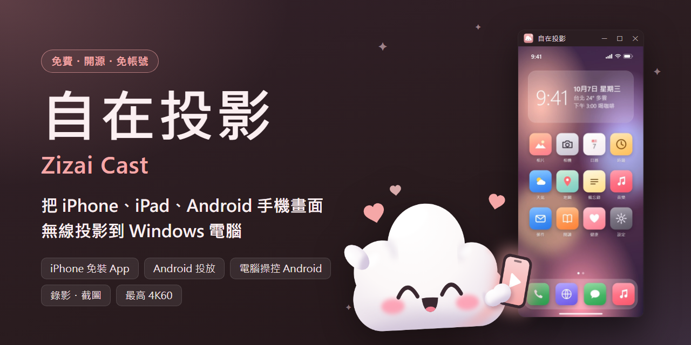

**繁體中文** ・ [English](README.en.md)

# 自在投影 Zizai Cast

**把 iPhone、iPad、Android 手機畫面無線投影到 Windows 電腦。**<br>
iPhone 不用裝 App、Android 還能用滑鼠鍵盤直接操控。免費、開源、沒有廣告、不用註冊帳號。

[](https://github.com/victor900106/ZizaiCast/releases/latest)
[](https://github.com/victor900106/ZizaiCast/releases)
[](#license)
[-BBA9F7?logo=windows)](#requirements)
[](#build)

<a href="https://victor900106.github.io/ZizaiCast/download/zizai-setup-latest.exe"></a>

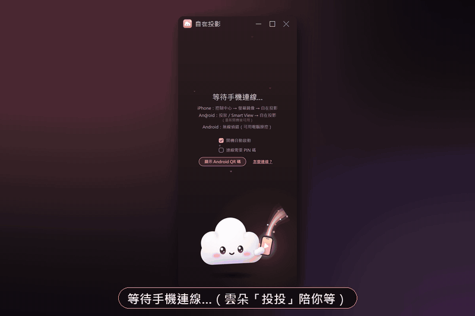

<sub>程式實際畫面（離屏錄製，視窗標題列與背景為後製）；手機內容是示範用的合成畫面，不含任何真實個人資料。</sub>

</div>

---

## ✨ 亮點

- 🍎 **iPhone / iPad 免裝 App**：控制中心 →「螢幕鏡像」→ 選「自在投影」，畫面和聲音就過來了（AirPlay）。
- 🤖 **Android 兩種連法**：手機內建的「投放／Smart View」（Miracast），或掃 QR 碼用「無線偵錯」連線——**可以用電腦的滑鼠、鍵盤直接操控手機**。
- ⚡ **低延遲**：電腦端從解碼到顯示約 **3 ms**（H.264 硬體解碼，開發者實測）；最高 **3840×2160（4K）/ 60 fps**（H.265）。
- ⏺ **錄影・截圖・傳到手機**：一鍵錄成 MP4（含聲音）、截成 PNG；實測錄影影音偏差 0.2 ms。截好的檔案可以**一次勾選多張傳到手機**。
- 🔍 **放大鏡**：最多放大 8 倍，加上弱視濾鏡（加強對比、黑白、反轉、黃字黑底）與凍結畫面。
- 🈯 **畫面翻譯**：把畫面上的英文、日文、韓文、簡體中文翻成繁體中文（或英文、日文、韓文），手機相機拍到的包裝、招牌、菜單也行；**內建文字辨識（OCR），在電腦上離線執行，文字不會上傳**。
- 🎨 **用起來舒服**：iPhone 外框、旋轉、4 種主題、多支手機接手、PIN 碼、系統匣常駐、開機自動啟動、一鍵更新；介面有**繁體中文、英文、日文、韓文**。
- 🔒 **資料不出你家網路**：畫面只在區域網路裡傳；沒有遙測、不用帳號。平常唯一的對外連線是檢查更新；翻譯模型只在你同意後下載一次（[詳見隱私說明](#privacy)）。
- 🆓 **免費、開源（GPL-3.0）、沒有廣告**。

## 🚀 3 步驟開始

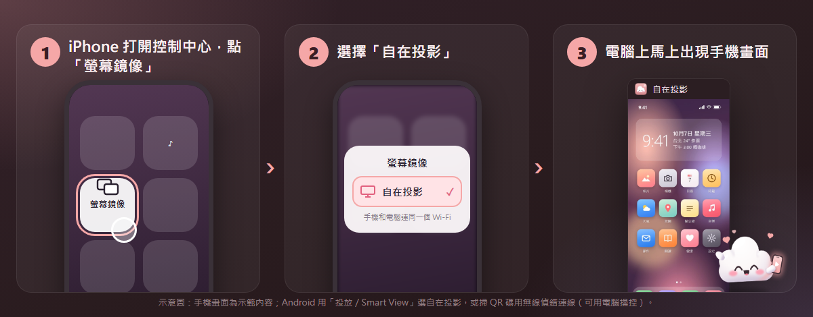

1. **下載安裝**：[直接下載最新版安裝程式](https://victor900106.github.io/ZizaiCast/download/zizai-setup-latest.exe)（快速下載點；也可以到 [Releases](https://github.com/victor900106/ZizaiCast/releases/latest) 下載 `zizai-setup-<版本>.exe`），點兩下安裝（不需要系統管理員權限）。第一次開啟時 Windows 防火牆詢問，請勾「私人網路」並按「允許」。
2. **手機和電腦連同一個 Wi‑Fi**（不是訪客網路；先關掉 VPN）。
3. **連線**
   - **iPhone / iPad**：控制中心 →「螢幕鏡像」→「自在投影」。
   - **Android（只要看）**：快速設定的「投放」（Samsung 叫 Smart View）→「自在投影」。
   - **Android（要用電腦操控）**：手機開「開發人員選項 → 無線偵錯 → 使用 QR 圖碼配對裝置」，掃電腦上「顯示 Android QR 碼」的 QR 碼。之後只要無線偵錯開著就會自動連回來。

<div align="center">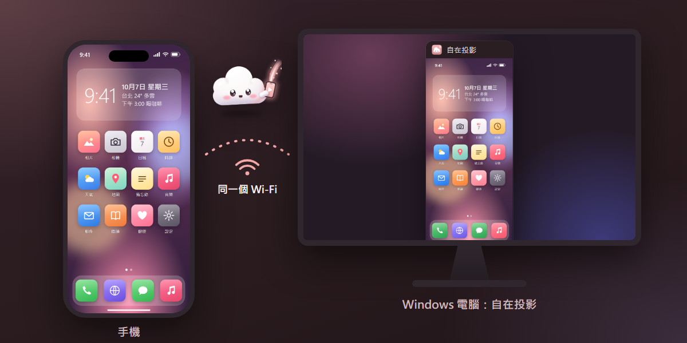</div>

## 🆕 v0.7.2 新功能

| | |
|---|---|
| 🔍 **放大鏡** | 最多放大 8 倍（Ctrl+滾輪，工具列 1× → 2× → 4×），右下角小地圖可拖曳移動；弱視濾鏡：加強對比、黑白、反轉、黃字黑底（Ctrl+K 切換）；凍結畫面（Ctrl+P）。 |
| 🈯 **畫面翻譯** | Ctrl+L 離線翻譯畫面上的英文、日文、韓文、簡體中文，手機相機拍的包裝、招牌、菜單也能辨識；譯文直接蓋在原文上，不會互相重疊。可框選範圍、顯示原文、連續翻譯，翻成繁體中文、英文、日文或韓文。**翻譯和文字辨識（內建 OCR）都在這台電腦上進行，文字不會上傳**；第一次使用前會先詢問，再下載模型。 |
| 📤 **傳到手機（一次多張）** | 截圖或錄影後點「傳到手機」，一次勾選多個檔案傳送。用無線偵錯連線的 Android 直接存進相簿；iPhone 等手機掃 QR 碼即可儲存（同一個 Wi‑Fi）。也可以開啟「截圖／錄影後自動傳到手機」。 |
| 🌐 **日文・韓文介面** | 介面和安裝程式新增日本語與한국어（設定 → 語言 / Language）。 |
| 🔔 **更新通知視窗** | 顯示這次更新了什麼，可立即更新、稍後提醒或略過這個版本；投影中不會打擾。 |

完整更新內容見 [Releases](https://github.com/victor900106/ZizaiCast/releases/latest)。

## 🧩 功能一覽

<table>
<tr>
<td width="33%" valign="top">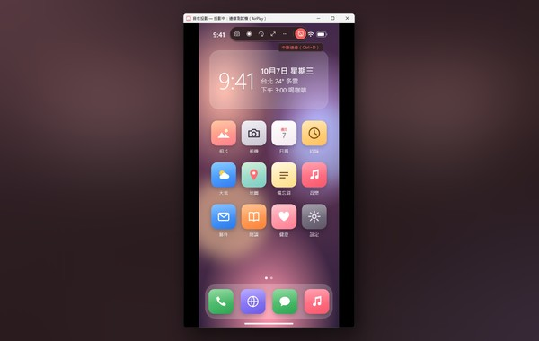<br><b>🍎 iPhone / iPad 鏡像</b><br>AirPlay 螢幕鏡像，免裝 App，畫面＋聲音。iPhone 的音量鍵可以調電腦音量。</td>
<td width="33%" valign="top">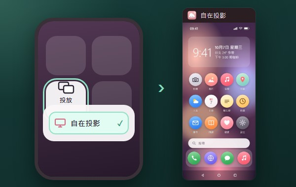<br><b>🤖 Android 投放</b><br>手機內建的「投放／Smart View」（Miracast）直接選自在投影。<a href="#faq">需要 Windows「無線顯示器」功能</a>。</td>
<td width="33%" valign="top">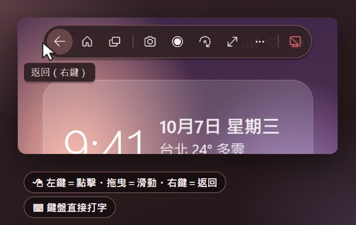<br><b>🖱️ 用電腦操控 Android</b><br>無線偵錯連線：左鍵點擊、拖曳滑動、滾輪捲動、右鍵返回、鍵盤打字；工具列有返回／主畫面／最近使用。</td>
</tr>
<tr>
<td valign="top">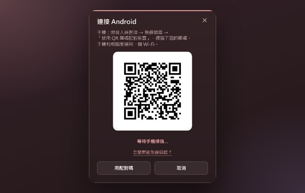<br><b>📷 掃 QR 碼配對</b><br>Android 11 以上：掃一下就配對，之後自動重連；也可以輸入 6 位數配對碼。</td>
<td valign="top">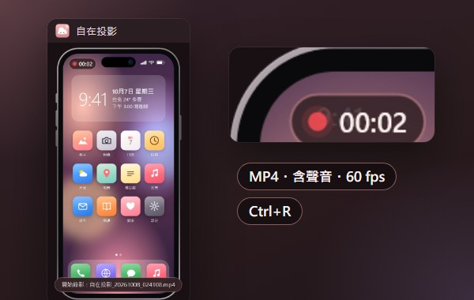<br><b>⏺ 錄影</b><br>Ctrl+R 錄成 MP4（60 fps、含聲音），右上角顯示錄影時間；斷線、換手機時自動存檔。</td>
<td valign="top">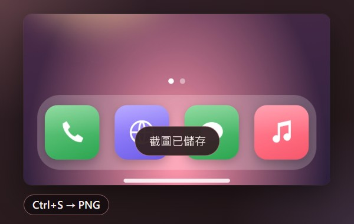<br><b>📸 截圖</b><br>Ctrl+S 或工具列一鍵截圖存成 PNG；開著 iPhone 外框時連外框一起截（透明背景）。</td>
</tr>
<tr>
<td valign="top">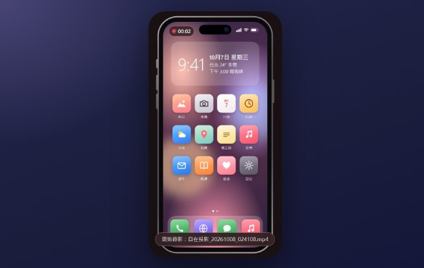<br><b>📱 iPhone 外框</b><br>Ctrl+F 加上手機外框，做教學影片、簡報示範更好看。</td>
<td valign="top">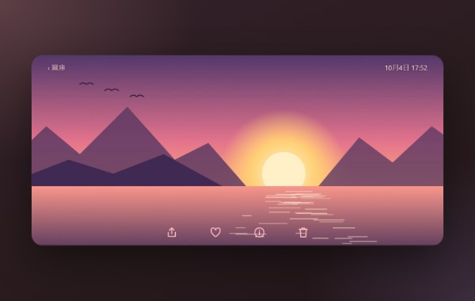<br><b>🔄 橫向・旋轉</b><br>手機轉橫向，視窗自動跟著轉；也能手動旋轉 90°、左右翻轉（Ctrl+→ / Ctrl+H）。</td>
<td valign="top"><br><b>🎨 4 種主題</b><br>櫻花粉、薄荷綠、夜空藍、奶茶；等待畫面有雲朵吉祥物「投投」陪你。</td>
</tr>
<tr>
<td valign="top">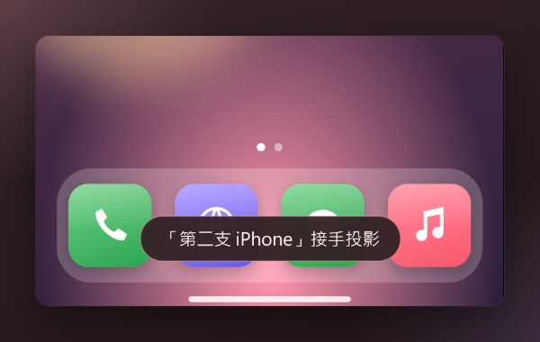<br><b>👥 多支手機接手</b><br>新手機連線時可以「接手」或「保持目前」，家人朋友輪流投影不用重開。</td>
<td valign="top">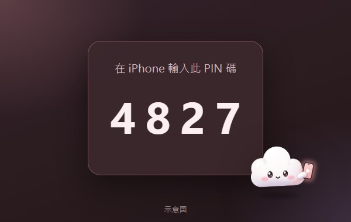<br><b>🔒 連線 PIN 碼</b><br>開啟後新的 iPhone 要輸入電腦上顯示的 4 位數 PIN 才能投影（成功過的會記住）。<sub>圖為示意。</sub></td>
<td valign="top">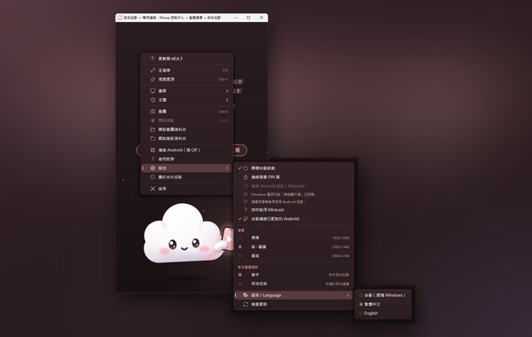<br><b>🌐 繁體中文／English／日本語／한국어</b><br>介面可切換繁體中文、英文、日文或韓文（設定 → 語言 / Language），預設跟隨 Windows 的顯示語言。</td>
</tr>
<tr>
<td valign="top">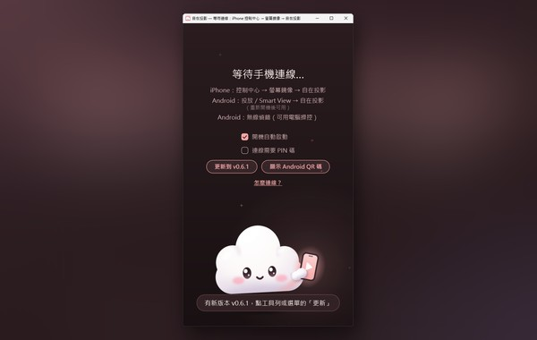<br><b>🧰 選單・系統匣・自動更新</b><br>關閉視窗縮到系統匣待命、開機自動啟動、視窗置頂、全螢幕；有新版時選「更新到 vX.Y.Z」一鍵更新（不會自己偷偷更新）。</td>
<td valign="top">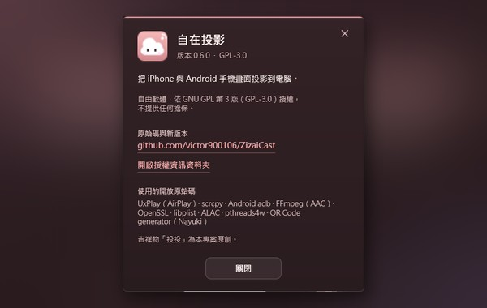<br><b>📜 開源・授權透明</b><br>「關於自在投影」列出版本、GPL-3.0 授權、原始碼位置與使用的開源元件；授權聲明隨程式安裝。</td>
<td valign="top">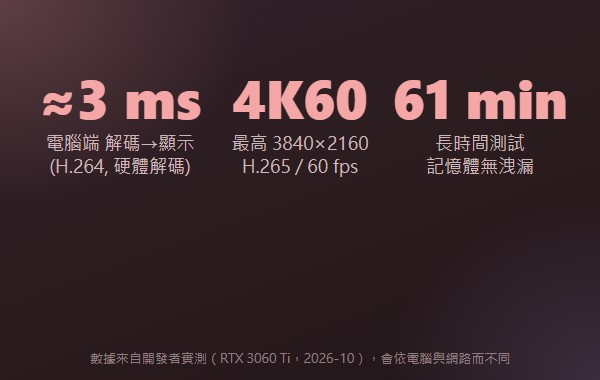<br><b>⚡ 低延遲</b><br>電腦端解碼到顯示約 3 ms；最高 4K / 60 fps。<a href="#measured">看實測數據</a>。</td>
</tr>
</table>

<a id="measured"></a>

## 📊 實測數據

以下是開發者在自己的電腦上量到的數字（RTX 3060 Ti、2026 年 10 月），實際表現會依電腦、Wi‑Fi 與手機而不同：

| 項目 | 結果 |
|---|---|
| 電腦端 解碼 → 顯示 | 約 3 ms（H.264 硬體解碼） |
| 畫質選項 | 1920×1080 H.264／2560×1440、3840×2160 H.265，皆 60 fps |
| 音訊恢復 | < 50 ms |
| 錄影影音偏差 | 0.2 ms（測試檔） |
| 長時間測試 | 連續 61 分鐘，記憶體與資源無洩漏 |

整體延遲還包含手機編碼與 Wi‑Fi 傳輸，這部分取決於手機和網路，我們沒有把它算進「3 ms」裡。


## 🤔 為什麼選自在投影

| | **自在投影** | 常見付費投影軟體 |
|---|---|---|
| 價格 | ✅ 完全免費 | 多為買斷或訂閱制（依產品而異） |
| 開放原始碼 | ✅ GPL-3.0，程式碼公開 | 多為閉源 |
| 廣告 | ✅ 沒有 | 依產品而異 |
| 需要註冊帳號 | ✅ 不用 | 依產品而異 |
| iPhone 要裝 App | ✅ 不用（AirPlay） | 多數 AirPlay 接收軟體也不用 |
| 用電腦操控 Android | ✅ 可以（無線偵錯） | 依產品而異 |
| 錄影 / 截圖 | ✅ 內建 | 多數有 |
| 資料去向 | ✅ 只在區域網路；沒有遙測 | 依產品而異 |

> 我們不比較特定產品；上表只寫我們能為自己保證的事。若你需要 Mac / Linux 版、或用電腦操控 iPhone，自在投影目前做不到（見[限制](#limits)）。

## 📥 下載與系統需求

| 下載 | 說明 |
|---|---|
| [**`zizai-setup-<版本>.exe`**](https://victor900106.github.io/ZizaiCast/download/zizai-setup-latest.exe)（[Releases 備用](https://github.com/victor900106/ZizaiCast/releases/latest)） | Windows 安裝程式，一般使用者請下載這個。免系統管理員權限，預設裝在桌面的「手機投影」資料夾（英文版為「Zizai Cast」）。 |
| `ZizaiCast-<版本>-source.zip` | 該版本的完整原始碼＋建置說明（在同一個 Release 頁面） |
| `ZizaiCast-<版本>-deps-source.zip` | 安裝程式內含函式庫的原始碼（OpenSSL、libplist、FFmpeg…） |

<a id="requirements"></a>

### 系統需求

| 項目 | 需求 |
|---|---|
| 電腦 | Windows 10 / 11，64 位元 |
| 網路 | 手機和電腦在同一個區域網路（建議 5 GHz Wi‑Fi 或電腦接網路線） |
| iPhone / iPad | 有「螢幕鏡像」的 iOS / iPadOS 裝置 |
| Android 投放 | 手機支援「投放／Smart View」（Miracast）；電腦需 Windows 選用功能「無線顯示器」、Wi‑Fi 網卡支援且 Wi‑Fi 開著。Google Pixel 不支援 Miracast，請改用無線偵錯 |
| Android 電腦操控 | Android 11 以上，開啟「開發人員選項 → 無線偵錯」 |
| 高、最高畫質（1440p / 4K） | 電腦需有 HEVC 解碼（Microsoft Store 的「HEVC 影片延伸模組」）；沒有時自動用 1080p |

## ⌨️ 快捷鍵

| 按鍵 | 功能 | 按鍵 | 功能 |
|---|---|---|---|
| F11／按兩下 | 全螢幕 | Ctrl+D | 中斷連線 |
| Ctrl+S | 截圖 | Ctrl+R | 開始／停止錄影 |
| Ctrl+→ / Ctrl+← | 旋轉 90° | Ctrl+H | 左右翻轉 |
| Ctrl+F | iPhone 外框 | Ctrl+0 | 還原畫面 |
| Ctrl+T | 視窗置頂 | 右鍵 | 完整選單（Android 畫面上是「返回」，選單請用工具列「更多」） |
| Ctrl+滾輪 | 放大鏡（最多 8 倍） | Ctrl+K | 弱視濾鏡 |
| Ctrl+P | 凍結畫面 | Ctrl+L | 畫面翻譯 |

<a id="faq"></a>

## ❓ 常見問題

<details>
<summary><b>安裝時出現「Windows 已保護您的電腦」？</b></summary>

安裝程式目前沒有數位簽章，所以 SmartScreen 會提醒。請按「其他資訊」→「仍要執行」。你也可以從 Release 頁面下載原始碼自己建置。
</details>

<details>
<summary><b>iPhone 找不到「自在投影」？</b></summary>

- 手機和電腦要在同一個 Wi‑Fi／區域網路（不是訪客網路、不是行動數據）；學校、公司、飯店網路可能封鎖裝置探索。
- 第一次開啟時 Windows 防火牆要允許「私人網路」。按了取消的話：搜尋「允許應用程式通過 Windows 防火牆」→ 變更設定 → 勾選自在投影的「私人」。
- 先關掉電腦和手機的 VPN。
- 同一台電腦只能有一個 AirPlay 接收程式，請先關閉其他接收軟體。
</details>

<details>
<summary><b>可以用電腦操控 iPhone 嗎？</b></summary>

不行。AirPlay 只傳畫面和聲音，iOS 沒有開放讓電腦操控 iPhone 的方式。用電腦操控只支援 Android（無線偵錯）。
</details>

<details>
<summary><b>看 Netflix、Disney+ 等影片時畫面是黑的？</b></summary>

有版權保護（DRM）的影片在螢幕鏡像時，手機本身就會把畫面變黑，這不是自在投影能繞過的。
</details>

<details>
<summary><b>Android 投放（Miracast）連不上／選單是灰的？</b></summary>

電腦需要 Windows 的選用功能「無線顯示器」（設定 → 系統 → 選用功能 → 新增「無線顯示器」，裝完重新開機），Wi‑Fi 網卡也要支援：在終端機輸入 `netsh wlan show drivers`，看到「Wireless Display Supported: Yes」才可以。也不要同時開行動熱點。不行的話請改用無線偵錯。Miracast 的聲音由 Windows 播放，不會錄進錄影檔。
</details>

<details>
<summary><b>無線偵錯一直斷線？</b></summary>

需要 Android 11 以上。手機重開機後無線偵錯常會自動關閉，再打開即可；也可以關掉手機的省電模式。仍不行就在手機上移除配對，重新掃 QR。不用時建議關掉無線偵錯，也不要在公共 Wi‑Fi 開啟。
</details>

<details>
<summary><b>延遲、卡頓或畫面糊？</b></summary>

改用 5 GHz Wi‑Fi 或讓電腦接網路線。延遲優先就把畫質調「標準」；畫面要清楚就調「高」或「最高」（需要 HEVC 影片延伸模組，下次連線生效）。
</details>

<details>
<summary><b>有 Mac 或 Linux 版嗎？有英文介面嗎？</b></summary>

目前只有 Windows 10 / 11（64 位元）。介面有繁體中文、英文、日文、韓文：設定 →「語言 / Language」，預設跟隨 Windows 的顯示語言。
</details>

<details>
<summary><b>真的免費？為什麼？</b></summary>

是的。自在投影以 GPL-3.0 開源，建立在 UxPlay、scrcpy、FFmpeg 等開源專案之上。沒有付費版、沒有廣告、不收集資料。喜歡的話請幫忙按 ⭐ Star 或分享給朋友。
</details>

<a id="limits"></a>

## 🚧 目前的限制

說清楚做不到的事，省得你白試：

- **iPhone 不能從電腦操控**（AirPlay 的限制）。
- **有 DRM 的影片會是黑畫面**（手機端就擋掉了）。
- **Miracast 需要 Windows「無線顯示器」功能**與支援的 Wi‑Fi 網卡；Miracast 的聲音不會錄進錄影檔。
- **Android 無線偵錯需要 Android 11 以上**。
- **YouTube 的「AirPlay 影片」（只傳網址的模式）不支援**，請用螢幕鏡像。
- **安裝程式沒有數位簽章**，SmartScreen 會提醒。
- 只支援 Windows 10 / 11 64 位元。

<a id="privacy"></a>

## 🔒 隱私

- **畫面、聲音、錄影、截圖都只在你的區域網路與電腦裡**，不經過任何伺服器。
- **沒有遙測、沒有分析、沒有廣告、不用帳號。**
- 程式平常唯一主動連上網際網路的地方是**檢查更新**（程式碼：`app/updater.cpp`；另外只有在你同意時才會下載翻譯模型，見下方）：
  - 開啟後 30 秒一次、之後每 24 小時一次，以及你按「檢查更新」時，向 `https://github.com/victor900106/ZizaiCast/releases/latest/download/update.json` 發出一個 HTTPS GET（只帶一般的 HTTP 標頭，User-Agent `ZizaiProjection-Updater/1.0`，不帶任何裝置資訊）。
  - 只有在你按下「更新到 vX.Y.Z」時，才會從清單裡的網址（`https://victor900106.github.io/ZizaiCast/download/`，速度比 Releases 快）下載安裝程式，並以 SHA-256 驗證後執行。
  - 不想檢查更新：在 `%LOCALAPPDATA%\PhoneMirror\settings.ini` 加一行 `update_url=`（留空）即可完全關閉。
- **畫面翻譯完全在電腦上離線執行**（程式碼：`translate/`）：畫面和文字都不會上傳。第一次使用前會先詢問，你同意後才下載模型：翻譯模型（Firefox Translations，約 50 MB）來自 `firefox-settings-attachments.cdn.mozilla.net`／`firefox.settings.services.mozilla.com`，文字辨識模型（PaddleOCR，約 37 MB）來自 `www.modelscope.cn`；每個檔案都以 SHA-256 驗證，可以在「管理翻譯模型」刪除。不同意的話不會連線。
- **傳到手機只在區域網路**（程式碼：`share/`）：Android 經無線偵錯直接傳進相簿；其他手機掃 QR 碼，從這台電腦上暫時開啟的網頁下載（只接受同一個區域網路的連線），不經過任何伺服器。
- 其他網路活動都在區域網路內：AirPlay 的裝置探索（mDNS）與串流、Miracast（Windows 內建）、Android 無線偵錯（程式自帶的 adb，只連你配對的手機）。
- 設定與記錄檔存在 `%LOCALAPPDATA%\PhoneMirror`（`settings.ini`、`phonemirror.log`），只在你的電腦上。

<a id="roadmap"></a>

## 🗺️ 路線圖

以下是**考慮中**的方向，不是承諾，也沒有時程。想要哪個，歡迎到 [Issues](https://github.com/victor900106/ZizaiCast/issues) 告訴我們：

- [ ] 安裝程式數位簽章（減少 SmartScreen 提醒）
- [ ] 更穩定的影音同步模式（看影片用）
- [ ] 支援 YouTube「AirPlay 影片」模式
- [ ] 透過 winget 安裝

<a id="build"></a>

## 🛠️ 從原始碼建置

需要 Visual Studio 2026 Build Tools（MSVC）、CMake 3.25 以上、vcpkg（`x64-windows`）。完整版本與步驟見每個 Release 附的 `source.zip` 裡的 `BUILD.md` 與 `docs/licenses/SOURCE.md`。

```bat
vcpkg install openssl libplist pthreads alac "ffmpeg[core,avcodec]" --triplet x64-windows
cmake -S . -B build -G "Visual Studio 18 2026" -A x64 -DCMAKE_TOOLCHAIN_FILE=<vcpkg>/scripts/buildsystems/vcpkg.cmake
cmake --build build --config Release
```

想幫忙？請看 [CONTRIBUTING.md](CONTRIBUTING.md)。回報問題請用 [Issues](https://github.com/victor900106/ZizaiCast/issues/new/choose)。

<a id="license"></a>

## 授權

自在投影是自由軟體，依 GNU 通用公共授權條款第 3 版（GPL-3.0）散布，授權全文見 [LICENSE](LICENSE)。每個版本的完整對應原始碼（Corresponding Source）都附在與安裝程式相同的 GitHub Release 頁面：

```
https://github.com/victor900106/ZizaiCast/releases
    ZizaiCast-<版本>-source.zip       （本程式原始碼＋建置說明）
    ZizaiCast-<版本>-deps-source.zip  （第三方函式庫的原始碼）
```

第三方元件的版本、授權與著作權聲明見 [`docs/licenses/第三方授權.txt`](docs/licenses/第三方授權.txt)（英文：[`THIRD_PARTY_NOTICES.txt`](docs/licenses/THIRD_PARTY_NOTICES.txt)），原始碼提供方式見 [`docs/licenses/SOURCE.md`](docs/licenses/SOURCE.md)。

吉祥物雲朵「投投」是本專案的原創角色，美術檔在 [`assets/public/toutou/`](assets/public/toutou/)。

## 🙏 致謝

自在投影站在這些開源專案的肩膀上：

- [UxPlay](https://github.com/FDH2/UxPlay)（AirPlay 接收端；以及其前身 [RPiPlay](https://github.com/FD-/RPiPlay)、[ShairPlay](https://github.com/juhovh/shairplay)、dsafa22 的 AirplayServer、PlayFair）
- [scrcpy](https://github.com/Genymobile/scrcpy)（Android 畫面與操控的手機端 server）與 Android [platform-tools（adb）](https://developer.android.com/tools/releases/platform-tools)
- [FFmpeg](https://ffmpeg.org/)（AAC 解碼）、[OpenSSL](https://www.openssl.org/)、[libplist](https://github.com/libimobiledevice/libplist)、[pthreads4w](https://sourceforge.net/projects/pthreads4w/)、Apple [ALAC](https://github.com/macosforge/alac)、[llhttp](https://github.com/nodejs/llhttp)
- [Nayuki QR Code generator](https://github.com/nayuki/QR-Code-generator)、[Inno Setup](https://jrsoftware.org/isinfo.php)

---

<div align="center">

**覺得好用嗎？按右上角的 ⭐ Star，讓更多人找到自在投影！**

[下載最新版](https://victor900106.github.io/ZizaiCast/download/zizai-setup-latest.exe) ・ [回報問題](https://github.com/victor900106/ZizaiCast/issues/new/choose) ・ [功能建議](https://github.com/victor900106/ZizaiCast/issues/new/choose)

</div>
